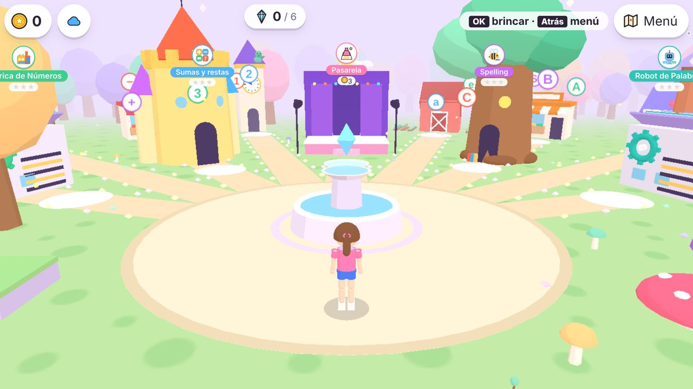
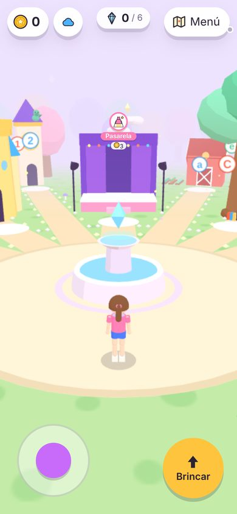
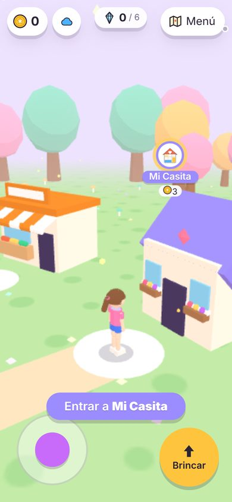
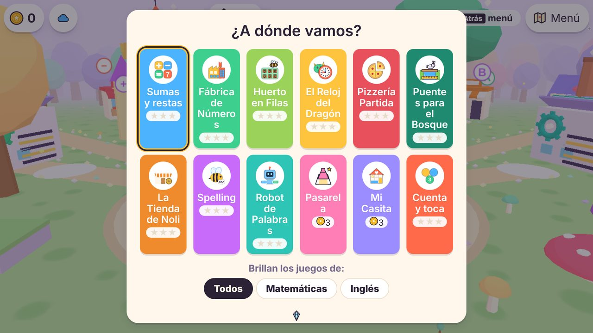
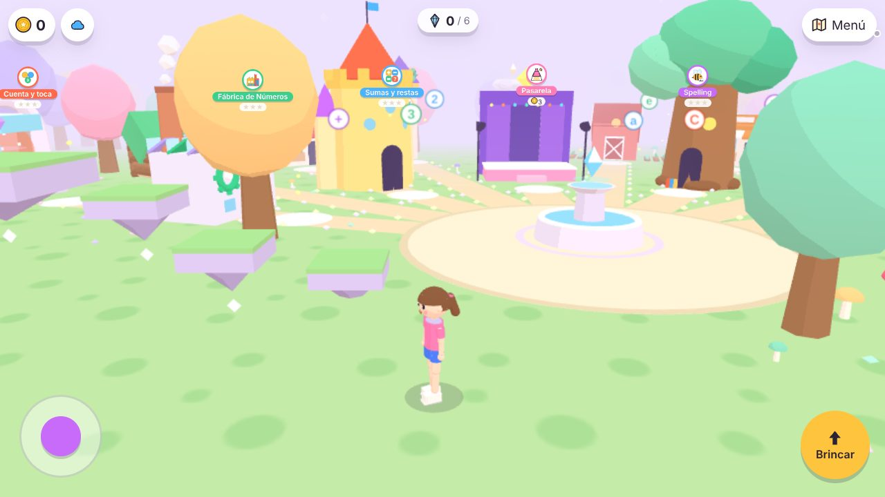
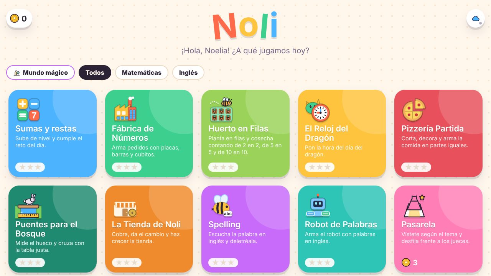

# El mundo mágico (menú principal en 3D)

Issue: #25. En lugar de una cuadrícula de tarjetas, el menú principal es un **mundo mágico en 3D**: Noelia camina (y brinca) con su personaje por un claro del bosque y entra a cada juego por la puerta de su edificio. Se hizo con el mismo método que la Pasarela (#19, #24): Three.js copiado en el repo y sin compilación, el personaje de partes, choques con formas sencillas, lugares descritos en JSON, una cámara que sigue al personaje y nunca gira, una calidad que se ajusta sola y un respaldo 2D.

**Respaldo:** si el aparato no aguanta el 3D, el menú es **la cuadrícula de siempre** (`src/ui/screens/catalogo.js`, sin cambios). Lo mismo si no hay WebGL, si la escena truena al armarse o si va muy lento y se dice que sí al menú sencillo. Nunca queda la pantalla en blanco.



| Teléfono | En la puerta de un juego | «¿A dónde vamos?» (Atrás o Menú) |
|---|---|---|
|  |  |  |



## Cómo se juega

| | Teléfono / tableta | Teclado | Control de la TV | Teléfono como control (#3) |
|---|---|---|---|---|
| Caminar | Joystick (pulgar izquierdo) o tocar el piso | Flechas | Flechas (mantenidas, sigue caminando) | Cruceta |
| Brincar | Botón **Brincar** (pulgar derecho) | Barra espaciadora | **OK**, o el botón **rojo** (keyCode 403 en LG y Samsung) | Botón **Brincar** |
| Entrar a un juego | Tocar el aviso "Entrar a…" o el letrero | Enter (OK) en la puerta | **OK** en la puerta | OK en la puerta |
| Menú "¿A dónde vamos?" | Botón **Menú** | Escape | **Atrás** | Atrás |

- **En la puerta de un juego, OK entra.** En cualquier otro lugar, OK brinca. El botón rojo y la barra espaciadora siempre brincan.
- **"¿A dónde vamos?"** (el menú): una tarjeta por juego. Al escoger una, el personaje **camina solo** hasta su puerta, sin brincar y rodeando lo que estorba. Ahí mismo están el filtro por materia ("Brillan los juegos de:", que enciende un anillo dorado alrededor de esos edificios y apaga los letreros de los demás), los créditos, la nube, el control remoto (en la TV), el botón **Menú sencillo** y cuántos cristales lleva.
- **Al salir de un juego**, el personaje aparece frente a la puerta de ese juego, viendo hacia la plaza.
- **Cristales mágicos:** hay 6, arriba de las plataformas. Al tocarlos se guardan (y se sincronizan con la nube como los datos de un juego, id `_mundo`). **No dan créditos:** los créditos se ganan en los juegos educativos (§12 de DESIGN.md). Son algo que encontrar.
- **Caerse nunca castiga:** no hay vidas, ni daño, ni hoyos. Si se cae de una plataforma, cae al pasto y sigue.
- Al empezar sale "¡Hola, Noelia! Camina hasta un juego para entrar." (en la TV: "…con las flechas…"), una vez por visita.

## El mundo

```
                         z = −39 ┌──────────────── fila de árboles ────────────────┐
         lejos-oeste-…           │  sitios a 32 m (libres: para juegos nuevos)     │
                                 │       nube-estrella (5.1 m) ✦                    │
        bosque-oeste-…           │  sitios a 23 m: reloj, pizzería, puentes…       │   bosque-este-…
                                 │       camino de nubes ↑                          │
            noroeste (castillo)  │   norte (escenario)   noreste (árbol)            │
     oeste (fábrica) ────────────┼────────── ( plaza + fuente ) ─────────┼──── este (fábrica del robot)
   escalera de     piedras       │              inicio (0, 4.2)          hongos     nenúfares
   cristal ✦      flotantes ✦    │                                      ✦          ✦ (estanque)
                         z = 12  └──────────── (frente: aquí está la cámara) ──────┘
                               x = −35                                           x = 35
```

- **La plaza** (radio 5.6 m) con una **fuente** en medio (se puede brincar encima: es la primera plataforma, con un cristal arriba). De la plaza sale un camino de tierra con piedritas que brillan hacia la puerta de cada juego.
- **Los sitios** (`mundo/lugares.json → sitios`): 5 a 13 m de la plaza, 8 a 23 m y 8 a 32 m, todos hacia el fondo o a los lados (la cámara mira hacia el fondo, −z; un edificio "detrás" de la cámara no se vería). Cada uno tiene un ángulo (0 = al fondo, 90 = a la derecha) y una distancia.
- **Los edificios** miran hacia la plaza; la puerta queda entre el edificio y la plaza.

| Edificio (`edificio`) | Juegos | Cómo es |
|---|---|---|
| `torre` | Sumas y restas | Castillo de números con números y signos que flotan alrededor |
| `arbol` | Spelling | Árbol de las letras con puerta, libros y letras que flotan |
| `escenario` | Pasarela | Tarima rosa, telón morado, focos y una estrella |
| `fabrica` | Fábrica de Números, Robot de Palabras | Nave con techo de dientes de sierra, engrane del color del juego y humo |
| `tienda` | La Tienda de Noli, Pizzería Partida | Tiendita con toldo de rayas del color del juego y frutas |
| `casita` | Mi Casita | Casita con techo del color del juego, macetas y un corazón |
| `huerto` | Huerto en Filas | Granero rojo con surcos de lechugas y zanahorias |
| `reloj` | El Reloj del Dragón | Torre con un reloj que **marca la hora de verdad** y un dragoncito en el techo |
| `cabana` | Puentes para el Bosque | Cabaña de troncos con un puentecito en la entrada |
| `portal` | Cualquier juego sin edificio propio (hoy: Cuenta y toca) | Arco de piedra con un remolino del color del juego |

- **Las plataformas** (`mundo/mundo.json → plataformas`), en 6 rutas de dificultad creciente. Las fáciles están junto a la plaza y las difíciles más lejos:

| Ruta | Dificultad | Dónde | Plataformas | Cristal |
|---|---|---|---|---|
| La fuente | 1 | En la plaza | 2 (0.6 m y 1.6 m) | Arriba de la fuente |
| Los hongos gigantes | 1 | A la derecha de la plaza | 3 (0.7 → 2.0 m) | En el hongo más alto |
| Los nenúfares | 2 | En el estanque | 3 hojas + una isla (0.2 → 1.6 m) | En la isla |
| Las piedras flotantes | 2 | A la izquierda de la plaza | 3 + un mirador (0.8 → 3.0 m) | En el mirador |
| La escalera de cristal | 3 | Más a la izquierda | 5 escalones + un mirador (0.6 → 3.6 m) | En el mirador |
| El camino de nubes | 3 | Al fondo, detrás del escenario | 5 nubes + la nube estrella (0.9 → 5.1 m) | En la nube estrella |

- **Todos los juegos se alcanzan caminando por el camino, sin brincar.** Las plataformas solo llevan a miradores y cristales: Noelia tiene 7 años y en la TV se juega con un control que tiene retraso, así que ningún juego queda detrás de un brinco difícil. (Hay una prueba que lo revisa: de la plaza se llega caminando a **cada** sitio, ocupado o no, sin subirse a nada.)
- **Decoración** (`src/engine/mundo.js → decorar`, con semilla: siempre sale igual): una fila de árboles en el borde del fondo y de los lados (al frente no, porque ahí está la cámara), árboles sueltos, hongos chiquitos, flores, luciérnagas y estrellas en el cielo. Nunca hay un árbol en la plaza, en un camino (hacia cualquier sitio, aunque esté libre), junto a una puerta, un edificio, una plataforma o el estanque.

## Archivos

```
mundo/
├── mundo.json                tamaño, plaza, colores, movimiento y brinco, plataformas, rutas, cristales, decoración
└── lugares.json              edificios (radio de choque y alto), sitios, y en qué sitio y edificio va cada juego
kit/3d/                       lo 3D que comparten el mundo y la Pasarela
├── vendor/                   Three.js r160.1, GLTFLoader y BufferGeometryUtils (MIT)
├── escena.js                 renderer, cámara, luces, ciclo de cuadros, calidad que se ajusta sola, pausar, liberar
├── avatar.js                 el personaje de partes (con la postura "brinco")
├── formas.js, materiales.js  piezas de ropa → mallas; materiales caricatura compartidos
├── lote.js                   juntar muchas piezas quietas en UNA malla por color (pocos dibujos por cuadro)
├── fisica.js                 caminar, brincar, pararse en plataformas (lógica pura)
├── movimiento.js             ángulos, seguir una ruta, flechas → dirección, un brinco por pulsación (lógica pura)
├── joystick.js               joystick para el pulgar (HTML)
└── webgl.js                  hayWebGL() sin bajar Three.js
src/engine/mundo.js           lógica pura del mundo: revisar datos, colocar juegos, choques, decoración, caminos para
                              "Ir a…", puerta cercana, cristales, letreros, brazo de la cámara, elegir 3D o 2D
src/mundo/
├── escena-mundo.js           dibuja el mundo (piso, plaza, caminos, estanque, plataformas, edificios, árboles…)
├── edificios.js              un edificio por tipo
└── vista.js                  une escena + mundo + personaje + física + cámara
src/ui/screens/mundo.js       la pantalla: lo que va encima del lienzo (HUD, letreros, aviso, joystick, Brincar, menú,
                              carga) y la entrada (dedo, teclado, control, teléfono)
styles/mundo.css              estilos de todo lo anterior
tests/mundo.test.js           pruebas (abajo)
```

**Capas** (las mismas reglas de DESIGN.md §2): `src/engine/mundo.js` y `kit/3d/fisica.js`/`movimiento.js` son lógica pura (sin DOM ni Three.js) y se prueban en Node. `src/mundo/` es lo único del catálogo que usa Three.js, y **se baja con `import()` solo cuando se va a usar el mundo**. El menú 2D no baja Three.js (670 KB) ni nada de `src/mundo/`.

### Cómo se conecta con la app

1. `src/main.js` decide la vista al arrancar con `elegirVista({ webgl, pref, params })` y la pone en `state.vista` (`"mundo"` o `"2d"`).
2. `src/ui/render.js`: con un juego abierto, el reproductor (y `ocultarMundo()`); si no, `mostrarMundo()` o el catálogo 2D (y `desmontarMundo()`).
3. El mundo vive en `<div id="mundo">`, **fuera de `#app`**, así el juego abierto (el iframe en `#app`) queda encima sin destruirlo:
   - **Teléfono:** al abrir un juego, el mundo solo se **pausa** (deja de dibujar) y se esconde. Al regresar sigue igual.
   - **TV:** al abrir un juego, el mundo se **libera** (`dispose` de todo: la memoria de la TV es poca y el juego la necesita). Al regresar se vuelve a armar con los datos y el módulo 3D ya bajados (`cache`), frente a la puerta del juego.
4. `src/ui/entrada.js`: con el mundo a la vista, las acciones del control van a `accionMundo(accion)`; con el menú 2D, igual que siempre. La barra espaciadora solo es "brincar" en el mundo; en el menú 2D y en los juegos sigue siendo OK.
5. `actions.ponerVista(v, { recordar })` cambia entre el mundo y el menú 2D; con `recordar`, se guarda en el aparato (`localStorage["noli.vista"] = "3d" | "2d"`).
6. La acción **`brincar`** es nueva en el control (`kit/protocolo.js → ACCIONES_CONTROL`, `kit/teclas.js`, `control.html`). **A los juegos no se les manda** (`actions.entrada` la ignora con un juego abierto): ellos siguen con sus seis acciones.

## Datos

### `mundo/mundo.json`

| Campo | Qué es |
|---|---|
| `limites` | `{ x0, x1, z0, z1 }`: hasta dónde se puede caminar (m). x hacia la derecha de la pantalla, z hacia abajo (la cámara mira hacia −z). |
| `inicio` | `{ x, z }`: donde aparece el personaje. |
| `plaza.radio` | Radio de la plaza. |
| `cielo`, `niebla` | Color del cielo y `[desde, hasta]` de la niebla (m). |
| `colores` | `pasto`, `pasto2` (manchitas), `plaza`, `camino`, `agua`. |
| `movimiento` | Física (abajo, § Física). |
| `estanque` | `{ x, z, r }`. |
| `plataformas` | `{ id, tipo, forma, x, z, alto, r \| ancho+fondo, grosor? }`. `forma`: `cilindro` (con `r`) o `caja` (con `ancho` y `fondo`). `alto`: dónde queda el techo (donde se para). `grosor`: si la plataforma **flota**, qué tan gruesa es (sin `grosor` llega hasta el piso). `tipo` es solo el dibujo: `fuente`, `hongo`, `nenufar`, `roca`, `piedra`, `cristal`, `nube`. |
| `rutas` | `{ id, nombre, dificultad, plataformas: [ids en orden] }`. Una prueba sube cada ruta brincando de verdad, de la primera a la última. |
| `cristales` | `{ id, en: id de plataforma, color }`. |
| `decoracion` | `semilla`, `arbolesBorde` (separación), `arbolesSueltos`, `hongos`, `flores`, `luciernagas`, `colores`. |

### `mundo/lugares.json`

| Campo | Qué es |
|---|---|
| `acercarse` | Radio (m) alrededor de la puerta en el que sale "Entrar a…". |
| `edificios` | `{ tipo: { nombre, radio, alto } }`. `radio` es el cilindro de choque: debe cubrir todo lo que está a la altura del personaje. `alto`, para la cámara y el letrero. Debe existir `portal`. |
| `sitios` | `{ id, angulo, distancia }` en el orden en que se llenan. |
| `juegos` | `{ id del juego: { sitio, edificio } }`. |

### `juego.json`

Campo opcional **`lugar`**: el edificio que quiere el juego (`"lugar": "casita"`). `lugares.json → juegos` gana sobre él. Si no dice nada o el edificio no existe, le toca un portal.

## Cómo agregar…

### Un juego

**No hay que hacer nada:** un juego nuevo en `catalogo.json` aparece solo en el siguiente sitio libre (en el orden de `sitios`), con un **portal** del color de su `juego.json` y su ícono en el letrero. Hoy quedan 9 sitios libres (12 juegos en 21 sitios). Si se acaban, la prueba "cada juego del catálogo tiene su lugar" falla: agregar sitios a `lugares.json` (más lejos o en los huecos), con ángulo y distancia, y correr `npm test` (revisa que no choquen con plataformas, que no tapen puertas y que se llegue caminando).

Para darle **su lugar fijo** y un **edificio**, una línea en `lugares.json → juegos`:

```json
"mi-juego": { "sitio": "bosque-este-72", "edificio": "tienda" }
```

### Un edificio nuevo

1. En `src/mundo/edificios.js`, un `else if (tipo === "mi-edificio")` que dibuje con `p(geometría, color, { pos, rot, esc, op })`. Las medidas son en metros, con el centro en (0, 0, 0) y la puerta mirando hacia **+z** (hacia la plaza). `op.color` es el color del juego (úsalo para que dos juegos con el mismo edificio se distingan). Lo que se mueve (humo, manecillas, letras que giran) va aparte, en `animados`.
2. En `lugares.json → edificios`, `"mi-edificio": { "nombre": "…", "radio": …, "alto": … }`. El `radio` debe cubrir la planta (la mitad de la diagonal de una caja). Lo bajito (menos de 0.3 m: surcos, tapetes) puede salirse, porque se camina por encima.
3. Asignarlo a un juego (arriba) y correr `npm test`.
4. Revisarlo en el navegador con `?fps`: abajo a la derecha salen los dibujos y triángulos. Un edificio debe sumar unos pocos dibujos (todo lo quieto se junta por color) y menos de ~3 000 triángulos.

### Una plataforma, una ruta o un cristal

Agregar la plataforma a `plataformas`, a su ruta en `rutas` y, si lleva cristal, a `cristales`. `npm test` revisa que se alcance brincando **con holgura** (85 % de la altura del brinco y 75 % del alcance: nada de brincos de precisión), que la ruta se suba brincando de verdad en la simulación, que no se encime con un edificio ni tape una puerta, y que el cristal esté encima de una plataforma alcanzable.

## Física (`kit/3d/fisica.js`)

El piso es plano (y = 0) con **sólidos** encima: cajas o cilindros con piso (`y0`) y techo (`y1`). El personaje es un cilindro (radio 0.35 m, alto 1.3 m).

| Ajuste (`mundo.json → movimiento`) | Valor | Qué hace |
|---|---|---|
| `velocidad` | 3.4 m/s | Caminando. Del inicio al fondo del mundo son unos 13 s. |
| `giro` | 420 °/s | Qué tan rápido voltea el cuerpo hacia donde camina (solo se ve). |
| `escalon` | 0.3 m | Lo más bajito que esto se sube caminando, sin brincar. |
| `brinco` | 1.25 m | Lo que sube un brinco. |
| `gravedad` | 20 m/s² | Un brinco dura ~0.7 s. |
| `coyote` | 0.12 s | Se puede brincar un ratito **después** de salir de una orilla. |
| `memoria` | 0.15 s | Un brinco apretado un poco **antes** de tocar el piso cuenta al tocarlo. |
| `impulsoTeclaMs` | 200 ms | Cuánto empuja cada flecha repetida del control de la TV. |

- **Un brinco por pulsación**, solo con los pies en algo (o en el tiempo de coyote): en el aire no se brinca otra vez. Mantener la tecla no hace brincos seguidos (`crearPulsador`: el control de la TV repite la tecla sin marcar `repeat`).
- En el aire se sigue mandando con el joystick; si se suelta, conserva la velocidad con la que brincó (así se brinca de una plataforma a otra).
- Choca de lado con un sólido si el techo del sólido está más alto que sus pies + un escalón y el piso del sólido más bajo que su cabeza. Por debajo de lo que flota alto se pasa caminando, y si se brinca abajo de algo, se pega en la cabeza.
- Se para sobre el techo más alto que tenga debajo, aunque esté en la orilla (hasta 60 % del radio afuera).
- `dt` máximo de 50 ms (lo limita `kit/3d/escena.js`): si la TV se traba, no atraviesa una plataforma delgada (hay prueba con cuadros lentos).
- Si algo lo deja adentro de un sólido, puede salir caminando. Si por cualquier cosa queda fuera del mundo, reaparece en la plaza.

## Cámara

- **Nunca gira** (no marea): siempre atrás y arriba del personaje, mirando hacia el fondo y adelante de él. En pantalla ancha va a 4.2 m de alto y 7.2 m atrás; en el teléfono parado, a 5.6 y 8.8 m (para ver lo de los lados). Sigue al personaje con suavizado.
- **Al brincar no rebota:** su altura sigue los pies con retraso, y solo sube cuando el personaje se queda arriba de una plataforma.
- **Brazo (`brazoCamara`):** si un edificio alto queda entre la cámara y el personaje (pasa en las puertas de los sitios de atrás, con los de adelante en medio), la cámara se acerca rápido y se aleja suave cuando ya no estorba.
- **Los árboles que tapan se encogen** con magia (`despejar`) y vuelven a crecer cuando ya no estorban. Las letras y números que flotan alrededor del castillo y del árbol se esconden si quedan entre la cámara y el personaje.

## Letreros

Son botones HTML encima del lienzo (se leen bien a 3 m y no cuestan dibujos 3D), uno por juego, arriba del frente de su edificio, con su ícono, nombre y estrellas o costo. Tocarlo entra al juego. `acomodarLetreros` decide cuáles se ven: los de más de 30 m no salen (al acercarse aparecen), los que se meterían bajo el HUD tampoco, y **si dos se enciman, gana el más cercano** (desde lejos se juntaban todos en una fila). Se escalan con la distancia y el de la puerta en la que está brilla.

## Respaldo 2D (el menú de siempre)

| Cuándo | Qué pasa |
|---|---|
| El navegador no tiene WebGL (`hayWebGL()` = no) | Menú 2D, y ni siquiera sale el botón "Mundo mágico" |
| Armar el mundo truena (datos rotos, Three.js falla…) | Se atrapa el error y queda el menú 2D (sin recordarlo: la siguiente vez lo vuelve a intentar) |
| Va muy lento: la calidad ya bajó a `baja` y sigue a menos de 15 fps | Pregunta "Este aparato va un poco lento. ¿Quieres cambiar al menú sencillo?". Si dice que sí, se libera la escena y **se recuerda en ese aparato** |
| Botón **Menú sencillo** (en "¿A dónde vamos?" y en la pantalla de carga) | Menú 2D, recordado |
| Botón **Mundo mágico** (al principio de los filtros del menú 2D) | Mundo, recordado |
| `?menu2d` | Menú 2D forzado (para probar) |
| `?menu3d` | Mundo forzado aunque se haya recordado el 2D (para volver a probar en la TV). Sin WebGL no hay mundo de todos modos |



Mientras baja Three.js y se arma la escena sale "Abriendo el mundo mágico…" con chispas que brincan y el botón **Menú sencillo**.

**Calidad** (las mismas reglas que la Pasarela, `kit/3d/escena.js`): en el teléfono empieza en `alta` (antialias, `pixelRatio` hasta 2) y en la TV en `media` (sin antialias, `pixelRatio` 1). Si pasan 3 s seguidos a menos de 26 fps, baja un nivel (`alta` → `media` → `baja` = `pixelRatio` 0.7). Si la pestaña se oculta, deja de dibujar.

`?sinaviso` quita la pregunta de "va lento" (para las pruebas en un navegador sin tarjeta gráfica, que siempre va lento).

## Rendimiento

Meta: **≥ 30 fps en el teléfono, la LG (webOS) y la Samsung (Tizen)**.

| Qué | Meta | Hoy (medido con `?fps`) |
|---|---|---|
| Dibujos por cuadro | < 150 | **78–137** (137 en la plaza con pantalla ancha de 1920×1080, donde se ve casi todo; ~80 en una puerta) |
| Triángulos en pantalla | < 30 000 (meta del issue) | **34 000–39 000**. **No se cumple todavía**: el personaje vestido son 9 000–10 000 de esos |
| Texturas | ≤ 1024 px | Todas de 64×64 (el pasto y cada número o letra que flota) |
| Descarga extra del mundo | — | Three.js 670 KB (167 KB comprimido; si ya se abrió la Pasarela, ya está en la caché) y BufferGeometryUtils, más el código y los datos del mundo: ≈ 110 KB (≈ 38 KB comprimido) |

Cómo se mantiene bajo:

- **Lotes** (`kit/3d/lote.js`): todo lo que no se mueve (edificios, plataformas, caminos, piedritas, la fuente) se junta en **una malla por color**. Un edificio de 40 piezas cuesta 3 o 4 dibujos.
- **Instancias** (`InstancedMesh`): árboles, hongos chiquitos, flores, estrellas y luciérnagas, un dibujo por tipo.
- Las gemas del remolino de cada portal son una sola malla que gira (antes eran 8 dibujos por portal). Las piedritas de los caminos son octaedros (8 triángulos, no 80).
- Lo que está a más de 58 m no se dibuja (la niebla lo tapa desde 52 m).

Mediciones:

| Aparato | Navegador | Fecha | Plaza | En una puerta | Calidad a la que se quedó | Notas |
|---|---|---|---|---|---|---|
| Chromium sin tarjeta gráfica (SwiftShader, todo por CPU, en la nube) | Chromium 141 headless | 2026-10-09 | 4–18 fps | 7–20 fps | baja | **No sirve como medida de un aparato real** (dibuja sin GPU). Sirvió para confirmar que la calidad baja sola, que sale la pregunta de "va lento" y que "sí" lleva al menú 2D, y para contar dibujos y triángulos (que no dependen del aparato). |
| Teléfono de Noelia | | *pendiente* | | | | |
| LG webOS | | *pendiente* | | | | |
| Samsung OLED 77" (Tizen) | | *pendiente* | | | | |

**Pendiente:** las mediciones en los tres aparatos reales (como en la Pasarela, no hay acceso a ellos desde la sesión donde se programó). Cómo medir: abrir `https://gcarrerap.github.io/noli/?fps` (en la TV, `…/?modo=tv&fps`). Abajo a la derecha sale `fps · calidad · dibujos · triángulos`. Anotar el dato en la plaza, caminando 10 s y en una puerta.

**Si una TV no llega a 30 fps**, en este orden (de lo que más ayuda y menos se nota a lo que más se nota):

1. Empezar la TV en `baja`.
2. Copas de los árboles con menos caras (`IcosahedronGeometry(1.5, 1)` → `(1.5, 0)` en `escena-mundo.js`): unos 4 500 triángulos menos.
3. Menos flores y luciérnagas (`decoracion` en `mundo.json`).
4. Bajar `lejos` (58 m) y la niebla para dibujar menos.

## Pruebas

`tests/mundo.test.js` (corre con `npm test`):

- **Datos:** `mundo/` está bien y `revisarMundo` encuentra datos rotos. `"lugar"` del `juego.json` es opcional y se valida.
- **Lugares:** cada juego del catálogo tiene lugar (en modo teléfono y TV) y **quedan al menos 3 sitios libres**. Los asignados van en su sitio con su edificio, un juego nuevo cae en el siguiente sitio libre con un portal, y con más juegos que sitios no truena. La puerta queda entre el edificio y la plaza, mirándolo, y se ve desde la cámara. "Entrar a…" solo sale en la puerta y con los pies en el piso.
- **Que nada estorbe:** el inicio y todas las puertas están libres, **de la plaza se llega caminando a cada sitio** (con la física de verdad, siguiendo la ruta de "Ir a…", sin subirse a nada) y de cualquier puerta a cualquier otra hay ruta. La decoración sale siempre igual y nunca queda en la plaza, en un camino ni en una puerta. Las plataformas no se enciman con edificios ni tapan puertas.
- **Física:** caminar y girar, la altura del brinco, sin brincos en el aire, coyote y memoria, chocar de lado, subir escalones, pararse encima, pegarse en la cabeza, pasar por debajo, caer sin castigo, salir de adentro de algo, no atravesar con cuadros lentos y conservar la velocidad en el aire. Una tecla mantenida es un solo brinco.
- **Plataformas:** todas se alcanzan con holgura y **cada ruta se sube brincando de verdad** en la simulación, de la primera a la última.
- **Cristales:** están sobre plataformas alcanzables y se tocan al pararse ahí (desde el piso no).
- **Letreros:** el cercano gana si se enciman; los lejanos, los de fuera de la pantalla y los que taparían el HUD no salen.
- **Cámara:** se acerca si un edificio alto estorba (los bajitos y los de al lado no cuentan), y desde ninguna puerta queda dentro de un edificio.
- **Vista:** el mundo por omisión; el 2D sin WebGL, si se recordó o con `?menu2d`; `?menu3d` gana a lo recordado pero no a la falta de WebGL.

Además, las pruebas de la Pasarela siguen armando el personaje y cada prenda con `kit/3d/` y `tests/sintaxis.test.js` revisa que cada módulo nuevo se analice y que sus imports existan.

**En el navegador** (a mano o con Playwright): `?fps` enseña los números y deja `window.noliMundo.vista` para diagnosticar (`.pos`, `.irA("spelling")`, `.irAPunto(x, z)`, `.info`). Lo que se probó así para este PR: el teléfono (390×844) y la TV (1920×1080): caminar con el joystick y con las flechas, brincar con el botón y con la barra espaciadora, "Ir a…" hasta cada tipo de edificio, entrar con OK y tocando el letrero, salir con la casita y con Atrás y reaparecer en la puerta (en la TV, con el mundo liberado y vuelto a armar), la pregunta de "va lento" → menú 2D recordado, `?menu2d`, `?menu3d`, el botón "Mundo mágico", un navegador sin WebGL, y la Pasarela sola con `kit/3d/`.

## Pendiente y decisiones

- **Reglas de Firestore:** la acción `brincar` del teléfono como control va directo por WebRTC; si WebRTC no conecta, va por Firestore, y para eso `firestore.rules` ya la acepta, pero **hay que publicar las reglas** en Firebase (README § Firebase). Mientras no se publiquen, solo en ese respaldo el botón Brincar del teléfono no hace nada (OK sí brinca).
- **Mediciones en aparatos reales** (arriba).
- **El personaje del mundo es el de la Pasarela**, con su último atuendo y su tono de piel (si el juego está en el catálogo). Si nunca ha jugado la Pasarela, sale con el atuendo inicial.
- **El filtro por materia** no esconde edificios: los resalta (anillo dorado) y apaga los letreros de los demás, en el mundo y en "¿A dónde vamos?". Así el mundo no cambia de forma según el filtro.
- **Cristales:** 6 para empezar; no dan créditos. Más adelante podrían abrir algo en el mundo (una ruta nueva, un sombrero…); eso va en otro issue.
