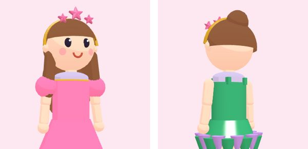

# Cómo agregar ropa

Hay dos maneras. **La normal es con formas** (escribir la prenda en `datos/prendas.json`): no hace falta ningún programa, pesa casi nada y se puede revisar en el navegador. **Con Blender** (un `.glb`) es para cosas que no salen con formas sencillas (una tiara con estrellas, un bolso con forma). Las dos usan el mismo personaje, los mismos colores y la misma puntuación.

Antes de empezar: lee las medidas del cuerpo y qué hace cada forma en [ESCENA-3D.md](ESCENA-3D.md#el-personaje-avatarjs).

---

## A. Prenda con formas (paso a paso)

### 1. Abrir el probador

```bash
python3 -m http.server 8000        # en la raíz del repo
# abrir http://localhost:8000/minijuegos/pasarela/herramientas/probador.html
```


El probador enseña el personaje con cualquier prenda (menús de la izquierda), color, tono de piel y postura ("Postura: quieto → caminar → desfilar → …" para ver que la ropa se mueve bien). Arrastra para girar. Abajo dice **cuántos triángulos** tiene el personaje vestido y si los datos tienen errores. Con `?prendas=a-camiseta,b-falda&pose=caminar` abre ya con esas prendas.

### 2. Copiar una prenda parecida

En `datos/prendas.json`, copia la prenda más parecida a la nueva y pégala en su categoría. Ejemplo completo (una blusa nueva), con lo que significa cada campo:

```jsonc
{
  "id": "a-marinera",              // letra de la categoría (p, a, b, v, z, x) + guion + nombre; sin acentos ni espacios
  "categoria": "arriba",           // peinado | arriba | abajo | vestido | zapatos | accesorio
  "es": "blusa marinera",          // lo que lee Noelia
  "genero": "f",                   // para "la blusa marinera" (m = el, f = la)
  // "plural": true,               // si en español es plural: "los tenis", "las sandalias"
  "en": "sailor blouse",           // en inglés; se ve en el panel y se escucha
  // "enPlural": true,             // si en inglés va sin "a": shorts, sneakers, sunglasses
  "etiquetas": ["escuela", "playa"],          // con qué temas va (lista en config.json → etiquetas)
  "colores": ["blanco", "azul", "rojo"],      // los que puede tener (colores.json); el primero es el de la miniatura
  "secundario": "azul",            // color fijo de los detalles (las piezas con "col": "s")
  // "brillo": true,               // brilla (lentejuelas, metal)
  // "lugar": "cabeza",            // SOLO accesorios y maquillaje (uno por lugar): cabeza | cara | cuello | abrigo | orejas | muneca | mano | espalda
                                   //   maquillaje: mejillas | ojos | labios | pintura
  "dibujo2d": "camisa",            // figura del modo sencillo y de la miniatura (src/ui/dibujo2d.js → FIGURAS)
  "piezas": [
    // el cuerpo de la blusa: un tubo en el torso, de y 0.42 (hombros) a −0.05 (cadera), radio 0.168, 74 % de fondo
    { "f": "tubo", "a": "torso", "y": [0.42, -0.05], "r": [0.168, 0.168], "z": 0.74, "tapa": "arriba", "col": "p" },
    // cuello marinero: una caja delgada en la espalda, color secundario
    { "f": "caja", "a": "torso", "pos": [0, 0.36, -0.12], "tam": [0.24, 0.1, 0.02], "col": "s" },
    // mangas cortas: en el brazo izquierdo; "espejo" pone la otra en el derecho
    { "f": "tubo", "a": "brazoI", "y": [0.03, -0.11], "r": [0.062, 0.058], "col": "p", "espejo": true }
  ]
}
```

(En el archivo real no van comentarios `//`: JSON no los acepta. Están aquí para explicar.)

### 3. Abrirla en un nivel

Toda prenda tiene que abrirse en algún nivel de `datos/desbloqueos.json` (si no, la prueba falla). Agrega su id a la lista `prendas` del nivel que quieras.

### 4. Ajustar mirando el probador

- **Traspasa el cuerpo** → sube el radio (`r`) 0.01 o 0.02. Las medidas de cada parte están en [ESCENA-3D.md](ESCENA-3D.md#el-personaje-avatarjs).
- **Flota o no llega** → mueve `y` (tubos) o `pos`. En brazos y piernas, y negativo es hacia abajo.
- **Se ve en un solo lado** → falta `"espejo": true` (y el ancla tiene que ser la de la izquierda, `…I`).
- **Se ve rara al caminar** → la falda va en `cadera` (no se mueve con las piernas); el pantalón va en `cadera` + `musloI` + `piernaI` con espejo, más una esfera en la rodilla (`piernaI`, pos `[0,0,0]`) para tapar la unión.
- Revisa en todas las posturas y con dos o tres colores.

### 5. Dibujo 2D

Si ninguna figura de `src/ui/dibujo2d.js → FIGURAS` se parece, agrega una: una función `(p, s) => "<path …>"` con el color principal `p` y el secundario `s`, en la capa correcta (`ropa`, `atras`, `frente`; los peinados llevan `atras` y `pelo`). Coordenadas: viewBox 0 0 200 360, la muñeca de frente (torso x 70–130, y 118–205; piernas en x 82 y 118 hasta y 320).

### 6. Probar

```bash
npm test     # revisa los datos, que la prenda se arme en 3D, su dibujo 2D y su tamaño
```

### Presupuesto

| | Límite | Cómo medirlo |
|---|---|---|
| Una prenda | < 6 000 triángulos (lo revisa la prueba) | Probador: triángulos con y sin la prenda |
| Personaje vestido completo | < 15 000 triángulos | Probador, con la ropa más pesada de cada categoría |
| Piezas por prenda | lo menos posible (cada pieza es un dibujo más por cuadro) | — |

Las esferas chicas ya usan menos caras solas; un `anillo` de 10 esferas son 10 dibujos, úsalo con cuidado.

### Lista antes de subir

- [ ] El id empieza con la letra de su categoría y no se repite.
- [ ] `es`, `en`, `genero` (y `plural`/`enPlural` si van) están bien: lee la frase en inglés del final y un comentario de los jueces.
- [ ] Etiquetas que existen, y que tengan sentido (¿con qué temas va?).
- [ ] Colores que existen; el primero se ve bien en la miniatura.
- [ ] Se abre en un nivel de `desbloqueos.json`.
- [ ] En el probador: de frente, de lado y de espaldas; en las 6 posturas; con 3 colores; con la ropa con la que se combina.
- [ ] Menos de 15 000 triángulos con todo puesto.
- [ ] Tiene `dibujo2d` y se ve en el modo sencillo (`index.html?modo2d`).
- [ ] `npm test` pasa.
- [ ] Si usa algo de fuera, su renglón en [LICENCIAS.md](LICENCIAS.md).

---

## B. Prendas con Blender (.glb)

Probado con **Blender 5.2.2 LTS** (los mismos pasos deberían servir desde Blender 4.2; si algo cambia de nombre, el script de la tiara es la referencia que sí está probada). El ejemplo completo es la tiara: `herramientas/blender/tiara.py` la genera y la exporta a `modelos/tiara.glb`.



### Reglas

| Regla | Por qué |
|---|---|
| **Metros.** El origen (0, 0, 0) es el **ancla** de la prenda. | El juego pega el modelo tal cual al ancla. |
| El personaje mira hacia **−Y** en Blender (vista *Frente*, tecla 1 del teclado numérico). | Al exportar, Blender pasa de Z-arriba a Y-arriba y −Y queda como +Z, el frente del juego. |
| La cabeza (ancla `cabeza`) es una esfera de radio 0.21 con centro en (0, 0, 0.19). Para otras anclas, las medidas de [ESCENA-3D.md](ESCENA-3D.md). | Para modelar encima del tamaño real. |
| Materiales llamados **`principal`** (toma el color que escoge Noelia) y **`secundario`** (el `secundario` de la prenda). Otros nombres se quedan con su color. | Así una sola tiara sale en todos los colores. |
| Sin texturas. Menos de 2 000 triángulos. Menos de 200 KB. | La TV. |
| Un solo `.glb` por prenda, en `modelos/`, nombre en minúsculas con guiones. | `revisarDatos` lo exige. |

### Paso a paso para alguien que nunca abrió Blender

1. **Instalar** Blender desde blender.org (gratis). Al abrir, cierra la ventana de bienvenida.
2. **Unidades:** panel derecho → ícono de cono y esfera (*Scene*) → *Units* → *Unit System: Metric*, *Unit Scale: 1.0*.
3. **Borrar el cubo:** clic sobre él, tecla `X` → *Delete*.
4. **Cabeza de referencia:** `Shift+A` → *Mesh* → *UV Sphere*. En el panel que aparece abajo a la izquierda: *Radius* 0.21, *Location* Z 0.19. En el panel derecho (*Object*), nómbrala `cabeza-referencia`. Para que no se exporte: no la selecciones al exportar (paso 10).
5. **Vista de frente:** tecla `1` del teclado numérico (o el menú *View → Viewpoint → Front*). Lo que ves de frente es la cara del personaje.
6. **Modelar** con formas: `Shift+A` → *Mesh* → *Torus*, *Cylinder*, *Cube*… Mover `G`, girar `R`, escalar `S` (y luego `X`, `Y` o `Z` para un solo eje; escribe un número para ser exacto). `Tab` entra a editar vértices. Usa la referencia para que no traspase la cabeza (deja 1 o 2 cm).
7. **Pocos triángulos:** al crear cada forma, baja *Segments* / *Rings* en el panel de abajo a la izquierda. Para ver cuántos hay: menú *Overlays* (arriba a la derecha del 3D) → *Statistics*.
8. **Materiales:** selecciona la pieza → panel derecho → ícono de esfera roja (*Material*) → *New* → doble clic en el nombre y escribe `principal` (o `secundario`). Las demás piezas del mismo color: el menú desplegable junto a *New* para escoger ese material.
9. **Aplicar la escala:** con todo seleccionado, `Ctrl+A` → *All Transforms* (si no, el tamaño puede salir distinto).
10. **Exportar:** selecciona solo las piezas de la prenda (no la referencia) → *File → Export → glTF 2.0 (.glb/.gltf)*:

    | Opción | Valor |
    |---|---|
    | Format | *glTF Binary (.glb)* |
    | Include → Limit to | ☑ *Selected Objects* |
    | Transform → +Y Up | ☑ |
    | Data → Mesh → Apply Modifiers | ☑ |
    | Data → Mesh → UVs | ☐ (no hay texturas) |
    | Data → Mesh → Normals | ☑ |
    | Data → Material → Materials | *Export* |
    | Data → Cameras / Punctual Lights | ☐ |
    | Animation | ☐ |

    Guarda en `minijuegos/pasarela/modelos/<nombre>.glb`.

11. **Registrar** en `datos/prendas.json` (sin `piezas`):

    ```json
    { "id": "x-tiara", "categoria": "accesorio", "lugar": "cabeza", "es": "tiara de estrellas", "genero": "f", "en": "star tiara",
      "etiquetas": ["princesa", "brillo", "magia", "fiesta"], "colores": ["dorado", "plateado", "rosa", "lila", "celeste"],
      "secundario": "rosa", "brillo": true, "dibujo2d": "tiara",
      "modelo": "modelos/tiara.glb", "ancla": "cabeza" }
    ```

    Opcional: `"pos"`, `"rot"` (grados) y `"esc"` para acomodarla sin volver a Blender.
12. Ábrela en un nivel de `desbloqueos.json`, agrega su `dibujo2d` (paso A.5), revísala en el probador y corre `npm test`.

**Con script** (como la tiara), el modelo se puede volver a generar igual siempre:

```bash
blender --background --python minijuegos/pasarela/herramientas/blender/tiara.py
# o, sin abrir Blender:  pip install bpy  &&  python3 minijuegos/pasarela/herramientas/blender/tiara.py
```

### Errores comunes

| Se ve así | Causa | Arreglo |
|---|---|---|
| No aparece | El `.glb` no cargó (ruta o nombre), o quedó muy lejos del ancla | Consola del navegador (F12); revisa `modelo` y que el origen esté en el ancla |
| Gigante o diminuta | Escala sin aplicar, o unidades que no son metros | `Ctrl+A` → *All Transforms*; *Unit Scale* 1.0 |
| De lado o al revés | Exportada sin *+Y Up*, o modelada mirando a +Y | Activa *+Y Up*; modela de frente con la tecla 1 |
| No cambia de color | El material no se llama `principal`/`secundario` | Renombra el material (no el objeto) |
| Negra | Normales al revés | En Blender, `Tab`, `A`, `Shift+N` (recalcular normales) |
| Traspasa la cabeza | Muy pegada a la referencia | Sepárala 1–2 cm, o súbele `esc` en `prendas.json` |
| Se mueve raro | Pegada al ancla equivocada | Cambia `"ancla"` (las piernas y brazos giran; `cadera`/`torso` casi no) |

---

## C. Maquillaje y joyería

- **Maquillaje:** `"categoria": "maquillaje"` con `"lugar"` `mejillas`, `ojos`, `labios` o `pintura` (caritas pintadas). Va pegado al ancla `cabeza`, casi sobre la piel: la cabeza es una esfera de radio 0.21 con centro en y 0.19 y la cara mira a +z, así que el rubor va en `pos` `[0.118, 0.13, 0.176]` con espejo y girado 32° hacia el lado (`m-rubor` en `prendas.json`). Usa formas planas (`plano`, `disco` muy delgado, `esfera` aplastada con `esc`) a 1 o 2 milímetros de la piel: más adentro se pierden en la cabeza; más afuera flotan. Revísalo en el probador de frente y de lado.
- **Joyería:** accesorios con `"lugar"` `orejas` (ancla `cabeza`, `pos` ≈ `[0.212, 0.125, 0]` con espejo, como `x-aretes-perla`), `cuello` (ancla `cuello`) o `muneca` (ancla `antebrazoD`, `pos` ≈ `[0, −0.14, 0]`, como `x-reloj`).
- **Qué mueble la ofrece:** la zona con esa categoría y, si la zona tiene `"lugares"`, solo de esos lugares (la vitrina de accesorios no enseña joyas; la joyería sí). `revisarDatos` revisa que cada lugar tenga un mueble.
- **Enfoque:** al abrir el mueble, la cámara enfoca lo que diga su `enfoque` en `zonas.json` (`cara` para el maquillaje, `alto` para la joyería). Ver ESCENA-3D.md § Enfocar lo que se prueba.
- **Dibujo 2D:** el maquillaje va en la capa `frente`, encima de la cara (ojos en y ≈ 72, mejillas en x 72 y 128, boca en y ≈ 92).

## D. Poses y bailes

1. Agrega la pose a `datos/poses.json`: `id`, `es`, `en` y `"baile": true` si se mueve con ritmo.
2. Dibújala en `kit/3d/avatar.js → posturas()`: un `case` que devuelve los ángulos de las articulaciones en radianes (`"brazoI.z": 2.4` sube de lado el brazo izquierdo). Parte de `quieto` (`{ ...quieto, … }`) para que lo demás regrese a su lugar. Agrégala a `POSES_3D` (y a `BAILES` si es baile).
3. Modo sencillo: una animación CSS para `.muneca2d.pose-<id>` en `estilo.css`.
4. Ábrela en un nivel (`"poses": [...]` en `desbloqueos.json`).
5. Mírala en el probador (botón "Postura") y corre `npm test` (revisa que `poses.json` y `POSES_3D` coincidan).

## E. Temas, colores y niveles

- **Tema nuevo** (`temas.json`): `id`, `nombre`, `para` ("perfecto para **un día de playa**"), `frase`, `icono` (un ícono de `src/ui/iconos.js`; agrega uno SVG si no hay), `etiquetas` con peso 1–3, `evitar`, `colores`. Ábrelo en un nivel. La prueba revisa que los temas del primer nivel se puedan vestir con el clóset inicial.
- **Color nuevo** (`colores.json`): `id`, `es`, `en`, `hex`. Ábrelo en un nivel y agrégalo a los `colores` de las prendas que lo acepten.
- **Etiqueta nueva**: en `config.json → etiquetas`, y úsala en prendas y temas.
- **Niveles** (`desbloqueos.json`): después de moverlos, corre `node minijuegos/pasarela/herramientas/simular-curva.mjs` para ver cuántas pasarelas toma cada nivel ([JUEGO.md](JUEGO.md#la-curva)).
