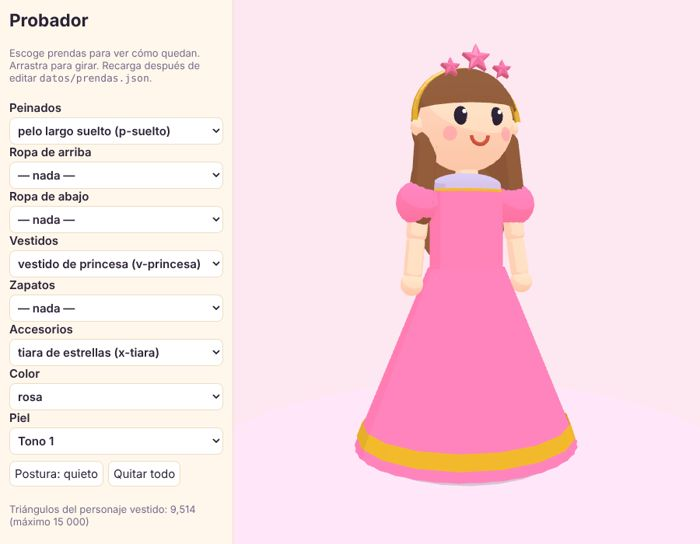
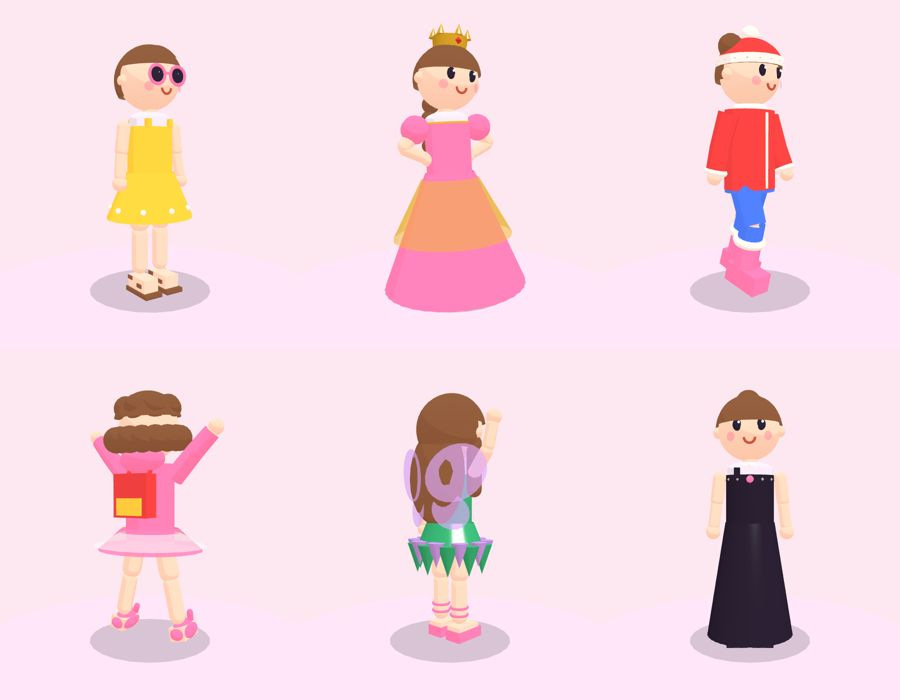

# Diseña ropa para la Pasarela

¡Hola, Noelia! Tú puedes inventar ropa nueva para el juego. Así se hace:

## 1. Dibújala

En una hoja, dibuja la prenda **de frente**. Ponle:

- **Su nombre** en español y, si lo sabes, en inglés (si no, lo buscamos juntos).
- **Qué es:** ¿peinado, ropa de arriba, ropa de abajo, vestido, zapatos o accesorio?
- **Sus colores:** ¿de qué colores puede ser? ¿Tiene detalles de otro color (botones, moño, rayas)?
- **¿Para qué tema va?** Playa, fiesta, escuela, deportes, pijamada, nieve, princesa, jardín, campamento, rock, gala, hada… ¿o un tema nuevo?
- **¿Brilla?**

## 2. Mírala con papá en el probador

Papá abre el **probador** en la computadora y la arma con formas: tubos, bolitas, cajas, conos. Tú le dices si se parece:

- ¿Más larga? ¿Más ancha? ¿Más abajo?
- ¿Así se ve bien cuando camina?
- ¿Y de espaldas?

Mira todo lo que ya hay para inspirarte:

## 3. Escoge en qué nivel se abre

¿La tendrás desde el principio o la tienes que ganar? Las cosas más especiales (como la tiara de estrellas o las alas de hada) se abren en los niveles más altos.

## 4. ¡A jugar!

Después de que papá la sube, aparece en su perchero con **¡Nuevo!**. Pruébatela y llévala a la pasarela.

---

*Para papá:* los pasos con detalle están en [ASSETS.md](ASSETS.md) (con formas, sin programas) y, para piezas especiales, la parte de Blender. Un tema nuevo va en `datos/temas.json` (ASSETS.md § C).
