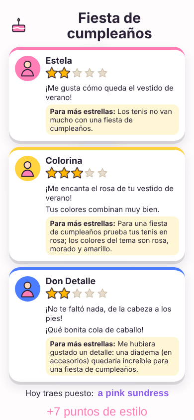
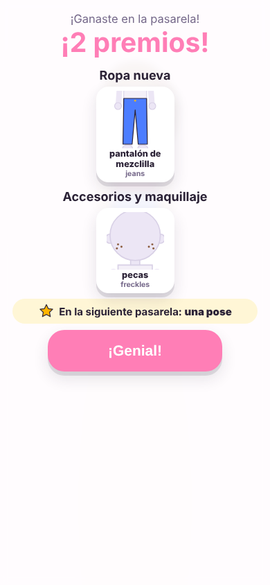
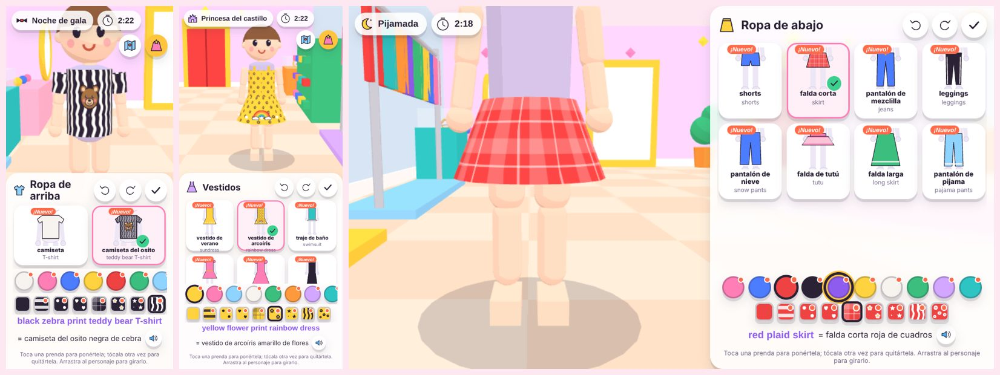
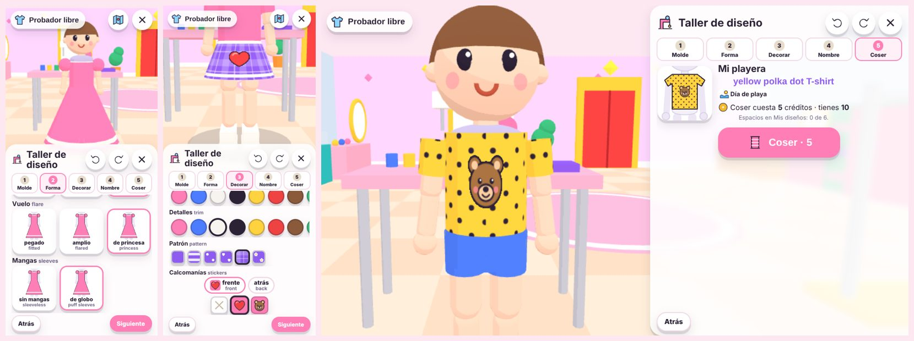
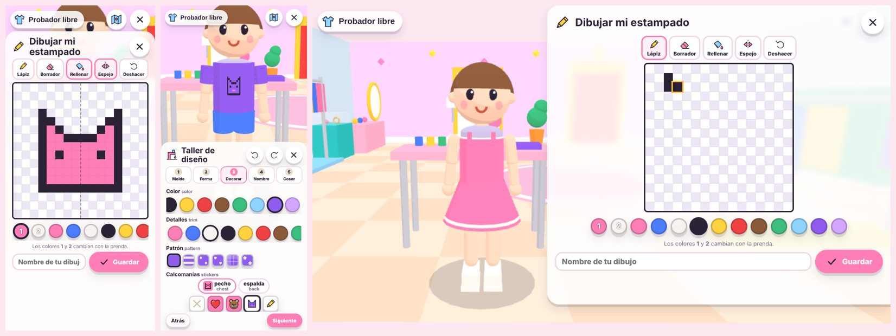
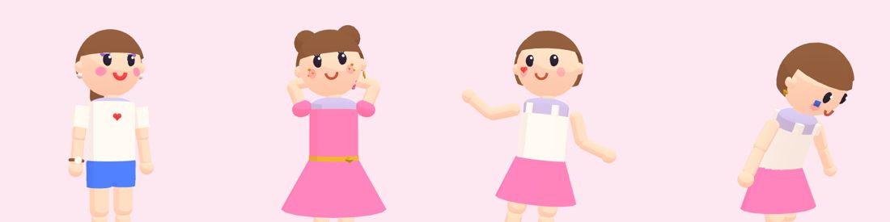

# Reglas de la Pasarela

## Una partida

1. En el inicio se ve el saldo y el costo. **"¡A la pasarela!"** cobra `config.costo` créditos (3) con `Noli.gastar`. Si no alcanzan: "Te faltan N créditos", con "Ir a jugar" (regresa al catálogo) y "Mientras, probarme ropa".
2. Sale un **tema** al azar entre los abiertos, sin repetir el anterior.
3. La ropa vuelve a la **de base** (solo se queda el peinado) y empieza el **estudio**: `config.tiempoEstudio` = 150 s. A los 30 s finales (`avisoTiempo`) el reloj se pone rojo. Al llegar a 0 se va sola a la pasarela; también se puede ir antes (botón dorado o la puerta roja).
4. **Pasarela:** desfila hasta el final.
5. **Poses:** al final de la pasarela escoge poses y bailes (los que tenga abiertos), uno o varios, y "¡Listo!".
6. **Calificación:** tres jueces, de 1 a 5 estrellas cada uno, un comentario positivo cada uno y un **consejo**. Se ve el atuendo en inglés y los puntos de estilo ganados.
7. Si subió de nivel: lo que se abrió (ropa, colores, tema o pose).

**Probador libre** (sin créditos): igual que el estudio, sin tema, sin reloj, sin pasarela y sin puntos. Se puede estar ahí todo lo que quiera.

## Temas

| Tema | Pide (peso) | Evita | Colores | Nivel |
|---|---|---|---|---|
| Día de playa | playa 3, verano 3, casual 1 | frío, pijama, elegante | amarillo, turquesa, celeste, naranja, rosa, blanco | Principiante |
| Fiesta de cumpleaños | fiesta 3, brillo 2, elegante 1, casual 1 | pijama, frío, deportivo | rosa, morado, amarillo, celeste, dorado, lila | Principiante |
| Primer día de escuela | escuela 3, casual 2 | pijama, elegante, playa | azul, rojo, blanco, verde, amarillo, café | Principiante |
| Día de deportes | deportivo 3, casual 1 | elegante, princesa, pijama | rojo, azul, blanco, negro, verde, naranja | Principiante |
| Pijamada | pijama 3, casual 1 | elegante, deportivo, playa | rosa, lila, celeste, blanco, morado | Principiante |
| Invierno en la nieve | frío 3, aventura 1 | playa, verano | blanco, celeste, azul, rojo, plateado | Curiosa |
| Princesa del castillo | princesa 3, elegante 2, brillo 2 | deportivo, pijama, playa | rosa, lila, dorado, celeste, morado | Divertida |
| Primavera en el jardín | flores 3, verano 1, casual 1 | frío, rock | verde, rosa, amarillo, lila, blanco | Diseñadora |
| Campamento en el bosque | aventura 3, casual 1, frío 1 | elegante, princesa, brillo | verde, café, naranja, azul, rojo | Superestrella |
| Estrella de rock | rock 3, brillo 2, fiesta 1 | pijama, princesa, flores | negro, morado, rojo, plateado, rosa | Leyenda |
| Noche de gala | elegante 3, brillo 2 | deportivo, pijama, playa, casual | negro, dorado, plateado, morado, rojo | Maestra del estilo |
| Hada del bosque | magia 3, flores 2, brillo 1 | deportivo, rock | verde, lila, turquesa, rosa, dorado | Reina de la pasarela |

(Datos en `datos/temas.json`; cuándo se abre cada uno: `datos/desbloqueos.json`.)

## Cómo califican los jueces

Todo está en `src/puntuacion.js` y es **determinista**: el mismo atuendo con el mismo tema da siempre lo mismo (así Noelia puede aprender qué funciona).

### 1. Encaje de una prenda con el tema (−2 a 3)

```
encaje = el peso más alto que el tema le da a alguna de sus etiquetas (0 si ninguna)
         − 2 si alguna de sus etiquetas está en "evitar"
```

Ejemplo, tema **Día de playa**: blusa de tirantes (verano, playa, deportivo) → 3. Tenis (deportivo, escuela, casual) → 1. Camisa de botones (escuela, elegante) → 0 − 2 = **−2**. Chamarra de invierno (frío, aventura) → −2.

### 2. Las cuatro cosas que miran (0 a 1 cada una)

| Componente | Fórmula |
|---|---|
| **tema** | Promedio del encaje de todo lo puesto ÷ 3, con pesos: vestido 2 (cuenta como arriba + abajo), accesorios 0.5, lo demás 1. Recortado a 0–1. |
| **color** | 0.7 × (fracción de la ropa —sin el pelo— cuyo color es de los del tema) + 0.3 × combinación. Combinación: 1 con 3 colores distintos o menos, 0.6 con 4, 0.3 con 5 o más. Sin ropa: 0. |
| **completo** | (cuerpo + zapatos + peinado) ÷ 3. Cuerpo = 1 con vestido o con arriba y abajo; 0.5 con solo uno de los dos. |
| **detalles** | Accesorios que van (encaje ≥ 2): ninguno 0, uno 0.7, dos o más 1; −0.3 por cada accesorio que no va (encaje < 0). Recortado a 0–1. |

### 3. Cada juez

| Juez | tema | color | completo | detalles | Habla de… |
|---|---|---|---|---|---|
| **Estela** (rosa) | 0.6 | 0.1 | 0.2 | 0.1 | la mejor y la peor prenda para el tema |
| **Colorina** (amarilla) | 0.3 | 0.5 | 0.1 | 0.1 | los colores |
| **Don Detalle** (azul) | 0.3 | 0.1 | 0.3 | 0.3 | si falta algo y los accesorios |

```
valor del juez = Σ peso × componente           (0 a 1)
estrellas del juez = 1 + redondear(valor × 4)  (1 a 5: nunca 0)
puntos de la pasarela = suma de las 3 estrellas (3 a 15)  → puntos de estilo
estrellas de Noli (catálogo) = 3 con 13 o más, 2 con 10 o más, si no 1; 0 solo si no trae nada puesto
```

### Ejemplo trabajado 1: playa perfecta

Tema **Día de playa**. Atuendo: cola de caballo café, blusa de tirantes amarilla, shorts blancos, sandalias rosas, lentes de sol rosas.

| Prenda | Etiquetas | Encaje | Peso |
|---|---|---|---|
| cola de caballo | deportivo, escuela, casual, **playa** | 3 | 1 |
| blusa de tirantes | **verano**, **playa**, deportivo | 3 | 1 |
| shorts | **verano**, **playa**, deportivo, casual | 3 | 1 |
| sandalias | **playa**, **verano**, flores | 3 | 1 |
| lentes de sol | **playa**, **verano**, rock | 3 | 0.5 |

- tema = (3·4 + 3·0.5) ÷ (3 · 4.5) = 13.5 ÷ 13.5 = **1**
- color: la ropa sin pelo es amarillo, blanco, rosa, rosa → los 4 son del tema (fracción 1); 3 colores distintos (combinación 1) → 0.7 + 0.3 = **1**
- completo: cuerpo 1 + zapatos 1 + peinado 1 → **1**
- detalles: un accesorio que va → **0.7**
- Estela: 0.6 + 0.1 + 0.2 + 0.07 = 0.97 → 1 + round(3.88) = **5**. Colorina: 0.3 + 0.5 + 0.1 + 0.07 = 0.97 → **5**. Don Detalle: 0.3 + 0.1 + 0.3 + 0.21 = 0.91 → 1 + round(3.64) = **5**.
- **15 puntos de estilo**, 3 estrellas en el catálogo. Consejo: "¡No le cambiaría nada!" (ningún juez tiene mejora).

### Ejemplo trabajado 2: el mismo atuendo en la nieve

Tema **Invierno en la nieve** (pide frío 3, aventura 1; evita playa y verano).

- Encajes: todas las prendas tienen "playa" o "verano" → la cola 0 − 2 = −2, la blusa −2, los shorts −2, las sandalias −2, los lentes −2. tema = (−2·4.5) ÷ 13.5 < 0 → **0**.
- color: blanco es del tema; amarillo y rosa no → 1/4 = 0.25; 3 colores → 0.7·0.25 + 0.3 = **0.475**.
- completo **1**; detalles: los lentes no van (−0.3) → **0**.
- Estela: 0.0475 + 0.2 = 0.2475 → 1 + round(0.99) = **2**. Colorina: 0.2375 + 0.1 = 0.3375 → 1 + round(1.35) = **2**. Don Detalle: 0.0475 + 0.3 = 0.3475 → **2**.
- **6 puntos**, 1 estrella. Lo bueno: "¡Me gusta cómo queda la blusa de tirantes!" · "¡Me encanta el blanco de tus shorts!" · "¡No te faltó nada, de la cabeza a los pies!". Lo que esperaban: Estela "Un suéter iría mejor que la blusa de tirantes." · Colorina "Para jugar en la nieve prueba tu blusa de tirantes en blanco; los colores del tema son blanco, celeste y azul." · Don Detalle "Los lentes de sol no van con jugar en la nieve; mejor …".

(Los dos ejemplos son pruebas en `tests/pasarela.test.js`.)

### Los comentarios

Cada juez dice **una o dos cosas buenas** (nunca se regaña) y, **si no dio 5 estrellas, siempre dice qué esperaba** ("Para 5 estrellas: …"). Antes cada juez decía solo una cosa buena y había un único "Consejo" para los tres, así que un juez podía dar 3 estrellas diciendo "¡No te faltó nada!" sin explicar por qué (Noelia se quejó de Don Detalle).

**Lo bueno:**

| Juez | Primero | Segundo (varía con el atuendo, sin azar) |
|---|---|---|
| Estela | La prenda con mejor encaje: "¡El vestido de fiesta es perfecto para una fiesta de cumpleaños!" (si ninguna pasa de 1: "¡Me gusta cómo queda…!") | Otra que va bien ("Y los tenis también van muy bien con el tema"), o "¡Se nota que pensaste en…!" |
| Colorina | "¡Me encanta el amarillo de tu blusa de tirantes!" (una prenda con color del tema) | Otro color del tema, el estampado ("¡Qué divertido el estampado de cebra!") o "Tus colores combinan muy bien" |
| Don Detalle | Un diseño suyo del Taller, un accesorio que va ("¡La gorra es el toque perfecto!") o "¡No te faltó nada…!" | Otro accesorio, el maquillaje o el peinado |

**Lo que esperaba:** cada juez habla primero de **su especialidad** (Estela: el tema; Colorina: los colores; Don Detalle: que no falte nada y los accesorios). Si ahí no tiene nada que decir, habla de lo que **más estrellas le quitó** (peso × lo que faltó de cada componente), sin repetir lo que ya dijo otro juez; si lo único que tiene es lo mismo, lo apoya ("Opino como Estela: …"). Siempre sugiere cosas **que ya tiene abiertas** y, para accesorios, **dónde están** en el estudio.

| De qué | Frases |
|---|---|
| tema | "Un suéter iría mejor que la blusa de tirantes." · "La camiseta es bonita, pero un suéter iría mejor para el primer día de escuela." · "Las botas no van mucho con…" |
| color | "Para jugar en la nieve prueba tu blusa de tirantes en blanco; los colores del tema son blanco, celeste y azul." · "Son muchos colores juntos…" · "Tus shorts en blanco se verían más de…" |
| completo | "Te faltó: zapatos, peinado." |
| detalles | "Los lentes de sol no van con jugar en la nieve; mejor un gorro de invierno (en accesorios)." · "Me hubiera gustado un detalle: unos lentes de sol (en accesorios) quedarían increíbles para un día de playa." · "Un detalle más, como una diadema (en accesorios), y sería perfecto." |



Si los tres dan 5 estrellas sale "¡Perfecto! ¡No le cambiaría nada!". El campo `consejo` (la mejora del juez con el valor más bajo) se sigue calculando. Los textos concuerdan en género y número con `genero` y `plural` de cada prenda (`src/espanol.js`). Una prueba califica cientos de atuendos en todos los temas y revisa que ningún juez dé menos de 5 sin decir por qué y que dos jueces no digan lo mismo.

## Créditos

- Costo: `config.costo` = **3** por pasarela (el catálogo lo enseña en la tarjeta con `juego.json → costo`; si se cambia uno, cambiar el otro).
- Se cobra **al empezar**, antes de ver el tema. Si se sale a la mitad (Atrás → "Sí, salir"), no se devuelve: la pantalla lo avisa.
- El juego nunca guarda ni calcula el saldo: lo lee al abrir (`Noli.creditos`) y usa el que regresa `Noli.gastar`. Si el catálogo no contesta en 5 s, no se cobra ("No se pudieron cobrar los créditos").
- La Pasarela **no da créditos** (`"creditos": "gasta"`); solo puntos de estilo. Los créditos salen de los juegos educativos (#20, DESIGN.md §12).
- Abierto solo (sin catálogo), el kit simula 10 créditos.
- **Taller de diseño:** coser una prenda cuesta `config.taller.costo` = **5** (`Noli.gastar(5, "taller")`), al tocar "Coser". Diseñar y probar es gratis.

## Puntos de estilo, niveles y premios

**Cada pasarela abre algo (#88).** Antes las cosas se abrían por niveles de puntos, y entre un nivel y otro pasaban 2 a 5 pasarelas sin nada nuevo; Noelia se frustraba, sobre todo con los accesorios y el maquillaje. Ahora:

- **Clóset inicial** (`desbloqueos.json → niveles[0]`): 18 prendas, entre ellas lentes de sol, diadema, mochila, aretes de perla, pulsera, rubor y labial; 7 colores, 5 temas, 3 poses, 2 patrones y 2 estampados.
- **La fila de premios** (`desbloqueos.json → premios`): todo lo demás, en orden. **Cada pasarela abre el siguiente premio, y uno más si saca 10 puntos o más** (`config.premios`: `porPasarela` 1, `extraDesde` 10 = 2 estrellas de Noli). Aunque le vaya mal, siempre gana uno.
- **Accesorios y maquillaje seguido:** en la fila, de cada 3 premios uno es un accesorio, una joya o maquillaje (alternando), hasta que se acaban; los otros dos son ropa, colores, temas, poses, patrones o estampados. Hay prueba.
- **Siempre hay algo que esperar:** el inicio y la pantalla de premios dicen qué tipo de cosa es el siguiente premio, sin decir cuál ("En tu siguiente pasarela ganas **maquillaje**"). Las prendas con candado dicen "¡En tu siguiente pasarela!" o "Faltan 4 premios".
- **Pantalla de premios** después de cada pasarela: "¡2 premios!", con lo que se abrió; si además subió de nivel, lo dice arriba.
- **Los niveles** (Aprendiz, Con estilo… Reina del diseño) siguen saliendo de los puntos de estilo (que se suman y nunca se pierden), pero **ya no abren cosas**: son títulos y la barra de progreso. Los espacios del Taller de diseño sí crecen con el nivel.
- **Se guarda** `progreso.premios` (cuántos de la fila ya abrió; formato v3). Un progreso de antes (v1/v2) recibe 1.5 premios por pasarela jugada, lo que más o menos habría ganado, para no perder lo que ya tenía.



La fila (en orden; se edita en `desbloqueos.json`, con claves como las de `vistos`: id de prenda, `c:` color, `t:` tema, `o:` pose, `pt:` patrón, `e:` estampado):

| Premios | Qué |
|---|---|
| 1–6 | gorra, suéter, color verde, pecas, pantalón de mezclilla, pose Dar una vuelta |
| 7–12 | gorro de invierno, patrón corazones, chamarra de invierno, sombra de ojos, tema Invierno en la nieve, botas de nieve |
| 13–18 | sombrero de playa, pantalón de nieve, color celeste, brillitos, camiseta del osito, traje de baño |
| 19–24 | reloj, pose Corazón, coletas, corazón pintado, patrón cuadros, pantuflas de conejo |
| 25–30 | corona, color morado, vestido de fiesta, estrella pintada, patrón flores, blusa de princesa |
| 31–36 | bufanda, tema Princesa del castillo, zapatillas de fiesta, pestañas largas, pose Baile de brazos, dos chongos |
| 37–42 | flor en el pelo, color lila, sudadera, aretes de estrella, blusa del corazón, trenza larga |
| 43–48 | collar de perlas, tema Primavera en el jardín, falda larga, reloj deportivo, pose Baile de lado a lado, vestido de princesa |
| 49–54 | arracadas, patrón estrellas, camisa de botones, bolsa, color naranja, falda de tutú |
| 55–60 | collar de corazón, pose Reverencia, leggings, moño, sudadera de estrella, botas |
| 61–66 | varita mágica, tema Campamento en el bosque, rizos, alas de hada, pose Saltar, pijama de una pieza |
| 67–72 | tiara de estrellas, color turquesa, top de brillos, chaqueta de cuero, chongo de bailarina, tema Estrella de rock |
| 73–78 | zapatos de ballet, pose Lanzar un beso, pelo largo suelto, color plateado, vestido de gala, tema Noche de gala |
| 79–84 | pose Baile del robot, vestido de hada, color dorado, tema Hada del bosque, pose Pensativa, vestido de arcoíris |
| 85–88 | patrón cebra, estampado arcoíris, patrón leopardo, estampado estrella |

Lo nuevo se marca **"¡Nuevo!"** en el panel (y un punto en los colores y patrones; "¡Nueva!" en las poses) hasta que se ve. Lo del clóset inicial nunca sale como nuevo.

### La curva

`herramientas/simular-curva.mjs` simula 200 jugadoras de cada estilo con temas al azar, como en el juego (`node minijuegos/pasarela/herramientas/simular-curva.mjs --md`). Pasarelas (mediana) para llegar a cada nivel de estilo, y cuándo abre el último premio:

| Nivel | Puntos | Pasarelas (con cuidado) | Pasarelas (a medias) | Pasarelas (al azar) |
|---|---|---|---|---|
| Principiante | 0 | 0 | 0 | 0 |
| Aprendiz | 16 | 2 | 2 | 2 |
| Con estilo | 33 | 3 | 4 | 4 |
| Curiosa | 51 | 5 | 5 | 6 |
| Creativa | 71 | 6 | 7 | 9 |
| Coqueta | 93 | 8 | 9 | 11 |
| Chispa | 116 | 10 | 12 | 14 |
| Original | 140 | 12 | 14 | 17 |
| Brillante | 166 | 14 | 16 | 20 |
| Atrevida | 194 | 16 | 19 | 23 |
| Divertida | 223 | 18 | 22 | 27 |
| Elegante | 253 | 20 | 24 | 31 |
| Glamorosa | 285 | 22 | 27 | 35 |
| Artista | 319 | 25 | 30 | 39 |
| Diseñadora | 354 | 27 | 33 | 43 |
| Modelo | 390 | 30 | 37 | 47 |
| Fotogénica | 428 | 32 | 40 | 52 |
| Fashionista | 468 | 35 | 44 | 57 |
| Estrella | 509 | 38 | 47 | 62 |
| Estrella brillante | 551 | 41 | 51 | 67 |
| Superestrella | 595 | 44 | 55 | 73 |
| Celebridad | 641 | 47 | 59 | 79 |
| Ícono | 688 | 50 | 63 | 85 |
| Ícono de la moda | 736 | 53 | 68 | 91 |
| Leyenda | 786 | 57 | 72 | 97 |
| Leyenda dorada | 838 | 60 | 77 | 104 |
| Diva | 891 | 64 | 82 | 110 |
| Maestra del estilo | 945 | 68 | 86 | 117 |
| Gran diseñadora | 1001 | 72 | 92 | 124 |
| Reina de la pasarela | 1059 | 76 | 97 | 131 |
| Maestra de estampados | 1118 | 80 | 102 | 139 |
| Reina del diseño | 1178 | 84 | 107 | 146 |

Premios (88; cada pasarela abre 1, o 2 con 10+ puntos): todo abierto en la pasarela con cuidado 44 · a medias 51 · al azar 73.

Puntos por pasarela en promedio: con cuidado 14.4 · a medias 11.1 · al azar 8.1. Mediana de 200 jugadoras simuladas por estilo.

**Por qué así:** en cada pasarela sale algo nuevo, así que siempre se siente que avanza; jugando con cuidado salen 2 premios casi siempre, así que fijarse en el tema paga. Todo se abre en ≈ 44 pasarelas con cuidado, ≈ 51 a medias y ≈ 73 al azar: a 3 créditos, unos 150 créditos para quien juega a medias. Si se siente lento o rápido: cambiar `config.premios` o el orden de `premios` y volver a correr el simulador.

## Poses y bailes

Al llegar al final de la pasarela aparece **"¡Escoge tu pose!"** con las poses abiertas (`datos/poses.json`). Cada toque hace esa pose o baile; se pueden hacer varias seguidas. **"¡Listo!"** (o 25 segundos sin escoger) termina: los jueces aplauden y sale la calificación. Las poses no cambian la calificación (son para lucirse). Al principio hay 3 (manos en la cintura, saludar, estrella) y 9 más se abren con los niveles; las nuevas dicen "¡Nueva!".

| Pose | Inglés | Tipo |
|---|---|---|
| Manos en la cintura | Hands on hips | pose |
| Saludar | Wave | pose |
| Estrella | Star | pose |
| Dar una vuelta | Spin | baile (con ritmo) |
| Corazón | Heart | pose |
| Baile de brazos | Arm dance | baile (con ritmo) |
| Baile de lado a lado | Side to side | baile (con ritmo) |
| Reverencia | Curtsy | pose |
| Saltar | Jump | baile (con ritmo) |
| Lanzar un beso | Blow a kiss | pose |
| Baile del robot | Robot dance | baile (con ritmo) |
| Pensativa | Thinking | pose |

## Patrones y estampados (#79)

Al escoger una prenda en el panel, debajo de los colores (círculos) salen los **patrones** (cuadritos): *lisa* y los abiertos, cada uno ya pintado con el color escogido. Tocar un patrón se lo pone a la prenda (si no la traía puesta, se la pone); tocar el que ya tiene la regresa a lisa. Cambiar de color conserva el patrón. Abajo dice cuántos faltan por abrir. Los patrones abiertos brillan con un punto hasta que se ven.

- **Qué prendas:** la ropa (arriba, abajo, vestidos, zapatos) y los accesorios de tela (sombrero, gorra, gorro, bolsa, mochila, bufanda, diadema). El patrón va en la tela del color principal; botones, suelas y detalles siguen de su color.
- **Inglés:** el patrón va entre el color y la prenda, como en inglés: *a pink zebra print T-shirt* = camiseta rosa de cebra. La bocina lo dice completo.
- **Jueces:** las etiquetas del patrón se suman a las de la prenda (cebra y leopardo: `rock`; cuadros: `escuela`, `aventura`, `frio`; flores: `flores`, `verano`…). Una camiseta negra de cebra le gusta más a Estela en *Estrella de rock* que una lisa. Para Colorina cuenta el color de la prenda, no el del patrón.
- **Estampados:** las prendas con calcomanía (camiseta del osito, blusa del corazón, sudadera de estrella, vestido de arcoíris) son prendas aparte que se abren con los niveles; su estampado se queda aunque cambie el color o el patrón. Los estampados sueltos (los que abre un nivel) son para el Taller de diseño (#80).



Cada pieza del atuendo guarda su patrón: `{ id: "a-camiseta", color: "rosa", patron: "cebra" }` (ver § Qué se guarda).

## Taller de diseño (#80)

Noelia **diseña su propia ropa** en el estudio: la mesa con la máquina de coser (adelante a la izquierda) es el **Taller de diseño**, y el perchero de adelante a la derecha es **Mis diseños**. Está en la pasarela con tema y en el probador libre; mientras el taller está abierto **el reloj de la pasarela se para**.

**Cinco pasos** (pestañas arriba; "Atrás" y "Siguiente" abajo). El personaje trae puesto el diseño todo el tiempo y la cámara enfoca su parte del cuerpo:

1. **Molde:** playera, vestido, falda, pantalón, zapatos o gorra (`datos/moldes.json`).
2. **Forma:** de 1 a 3 controles con opciones dibujadas (no números): largo (corta / media / larga), mangas (sin / cortas / largas), vuelo (pegada / amplia / de princesa), corte, alto, suela, visera… Cada opción tiene su nombre en inglés (*long sleeves*, *flared*).
3. **Decorar:** color, color de los detalles (listones, cuello, suela), patrón (los abiertos, #79) y **calcomanías**: se escoge el lugar (pecho, espalda, falda, piernas…) y luego el estampado. Una por lugar. En la TV todo es con flechas: los lugares son botones, no hay que arrastrar.
4. **Nombre y temas:** escribe el nombre (18 letras como mucho) o toca uno sugerido ("Playera de cebra", "Vestido del osito"…; en la TV no hay que escribir). Escoge **1 o 2 temas**: son las etiquetas del diseño para los jueces (las de peso 3 de cada tema). Como mucho 2, para que no pueda poner todos y ganar siempre.
5. **Coser:** cuesta **`config.taller.costo` = 5 créditos** (`Noli.gastar`), más que una pasarela porque es para siempre. Si no alcanzan: "Te faltan N créditos" y el diseño se queda guardado como **borrador**. Si ya no hay espacio: hay que descoser uno.

**Probar es gratis:** cada cambio se guarda en el borrador (`progreso.borrador`), así que salir del taller no pierde nada. La primera vez sale una guía corta.

**Mis diseños:** lo cosido aparece en ese perchero (no en los demás) y se usa como cualquier prenda: pasarela, clóset, fotos, modo 2D, el mundo del menú principal. Su color, patrón y calcomanías son fijos (son parte del diseño). **Espacios:** 4 al empezar y uno más cada 6 niveles, hasta 9 (`config.taller`). **Descoser** (con pregunta) libera el espacio; los créditos no regresan.

**Jueces:** se califica igual que cualquier prenda; la jueza del tema le da 3 de encaje en los temas que escogió. Don Detalle lo nota: "¿Tu falda corta «Girasol» la hiciste tú? ¡Qué original!" (solo el comentario; la fórmula no cambia).

**Inglés:** la frase dice el nombre: *a pink star print long dress called "Estrellita"*.

**Nunca sale rota:** las opciones solo mueven medidas dentro de lo que el molde permite, y lo que va encima (listones, calcomanías) se calcula sobre la tela que queda abajo. Una prueba arma **todas las combinaciones de todos los moldes** y revisa que ningún tubo quede más delgado que la ropa que ya existe en esa parte del cuerpo, que nada se hunda en la tela, y que cada una se arme en 3D con menos de 6 000 triángulos (ASSETS.md § G).



### Dibujar estampados (#81)

En el paso **Decorar**, el botón del lápiz (al final de las calcomanías) abre **"Dibujar mi estampado"**: una cuadrícula de **16×16** cuadros.

- **Herramientas:** lápiz, borrador, rellenar (cubeta: llena la mancha del mismo color), **espejo** (lo que pinta de un lado sale igual del otro; una línea punteada marca la mitad) y deshacer (cada trazo, hasta 40).
- **Colores:** los abiertos y dos especiales, **1** y **2**: el color principal y el de los detalles **de la prenda**. Lo pintado con 1 y 2 cambia cuando cambia el color de la prenda (un gatito con la cara "1" sale rosa en una playera rosa y morado en una morada).
- **Con el dedo:** se pinta arrastrando; la página no se mueve ni hace zoom mientras pinta (`touch-action: none`), y un trazo rápido no deja huecos (se rellena la línea entre un punto y el siguiente).
- **En la TV:** cada cuadro es un botón: con las flechas se mueve el cursor (se ve con borde y halo) y **OK pinta** un cuadro. Es más lento que con el dedo, pero se puede; para dibujos grandes conviene el teléfono, y lo dibujado se sincroniza a la TV.
- **Guardar** (con nombre) no cuesta: lo que cuesta es coser la prenda que lo lleva. Se guardan hasta **`config.taller.maxDibujos` = 6** dibujos. Al guardar se pone en el lugar escogido de la prenda. Si la calcomanía puesta es un dibujo suyo, salen "Cambiar mi dibujo" y "Borrar" (con pregunta; los diseños que lo traían se quedan sin esa calcomanía).
- Se ve igual en el taller, en 3D (textura pixelada, sin suavizar), en el modo sencillo, en las miniaturas y en el clóset.



## Maquillaje y joyería

Además de la ropa hay **maquillaje** (categoría `maquillaje`: rubor, labial, sombra de ojos, pestañas largas, pecas, brillitos, corazón y estrella pintados) y **joyería** (accesorios de orejas, cuello y muñeca: aretes de perla, arracadas, aretes de estrella, collar de perlas, collar de corazón, reloj, reloj deportivo, pulsera). Van **uno por lugar** (`config.json → lugares`): mejillas, ojos, labios y pintura en la cara; orejas, cuello, muñeca, y los de antes (cabeza, cara, abrigo, mano, espalda). Para los jueces cuentan como **detalles** (igual que los accesorios). En el estudio están en dos muebles nuevos: el **tocador de maquillaje** (derecha) y la **joyería** (izquierda).



## Qué se guarda

Con `Noli.guardar(progreso)` (el catálogo lo guarda en `noli.datos.pasarela` y lo sincroniza en la nube):

```js
{
  v: 3,                    // versión del formato; leerProgreso() convierte o descarta lo que no entienda (v1 → v2: disenos vacío; v2 → v3: premios = 1.5 × pasarelas)
  premios: 14,             // cuántos de la fila de premios ya abrió (#88)
  puntos: 41,              // puntos de estilo acumulados
  pasarelas: 4,            // pasarelas con tema
  vistos: ["a-camiseta", "c:rosa", "t:playa", "o:vuelta", "pt:cebra", …],   // lo que ya no brilla como nuevo (prendas, "c:" colores, "t:" temas, "o:" poses, "pt:" patrones)
  atuendos: [              // el clóset: los últimos config.maxAtuendosGuardados (12), el más nuevo primero
    { fecha: 1760000000000, tema: "playa", estrellas: [5, 5, 5], puntos: 15,
      atuendo: { peinado: { id: "p-cola", color: "cafe" }, arriba: { id: "a-camiseta", color: "rosa", patron: "cebra" }, abajo: {…}, vestido: null, zapatos: {…},   // patron: opcional
                 accesorios: { cara: { id: "x-lentes", color: "rosa" }, labios: { id: "m-labial", color: "rojo" } } } }   // accesorios y maquillaje, por lugar
  ],
  piel: 0,                 // índice en config.tonosPiel
  ultimo: { … },           // el último atuendo (para el probador libre y el peinado de la siguiente pasarela)
  ultimoTema: "playa",     // para no repetirlo
  disenos: [               // lo que cosió en el Taller (#80), el más viejo primero; ~300 caracteres cada uno
    { id: "d-mf3k2a1x", molde: "vestido", ajustes: { largo: "largo", vuelo: "princesa", mangas: "globo" },
      color: "lila", secundario: "dorado", patron: "estrellas", calcas: [{ estampado: "estrella", lugar: "falda" }],
      nombre: "Estrellita", temas: ["princesa", "gala"], fecha: 1760000000000 }
  ],
  borrador: null,          // lo que estaba diseñando sin coser (mismo formato; el nombre puede ir vacío)
  dibujos: [               // estampados que dibujó (#81), hasta config.taller.maxDibujos; 50 a 600 caracteres cada uno
    { id: "px-mv1g8az", nombre: "Gatito", lado: 16, paleta: ["negro", "rosa"], datos: "51.a8.a6.2a6.2a…", fecha: 1791579590056 }
  ]
}
```

Los **dibujos** se guardan comprimidos por corridas (*run-length*): `datos` es una cadena de `[cuántos]caracter`, renglón por renglón desde arriba; `.` = transparente, `P`/`S` = los colores de la prenda, y `a`–`z` = el color en esa posición de `paleta` (ids de `colores.json`, así un cambio de tono en colores.json se ve en los dibujos viejos). `"51.a8.a"` = 51 transparentes, 1 del primer color, 8 transparentes, 1 del primer color… Un color que ya no existe se vuelve negro; lo que no se entienda, transparente; siempre salen 16×16. `leerProgreso` lee los dibujos **antes** que los diseños (sus calcomanías los usan).

Los diseños se guardan como **receta** (molde + opciones), no como piezas: así ocupan poco (lo más grande posible, 9 diseños con nombres largos y todas las calcomanías más el clóset lleno de diseños, son menos de 20 000 caracteres; la nube acepta 200 000; hay prueba) y si se mejora un molde, los diseños viejos se ven mejor solos. `leerProgreso` registra los diseños en `idx.prendas` (`taller.js → registrarDisenos`) **antes** de revisar los atuendos guardados, para que un atuendo con un diseño puesto no lo pierda. Un diseño cuyo molde ya no existe se descarta; una opción que ya no existe vuelve a la inicial.

**Lo que NO se guarda aquí:** créditos (el catálogo), la preferencia 3D/2D (`localStorage["noli.pasarela.vista"]`, solo de ese aparato), el nivel (sale de los puntos), lo abierto (sale del nivel).

Si se cambian los datos (se borra una prenda, se renombra un tema, se quita un patrón), `leerProgreso` y `limpiar` quitan del clóset lo que ya no existe sin tronar (una prenda con un patrón que ya no existe, o que ya no acepta patrón, queda lisa). El campo `patron` es opcional, así que los atuendos guardados antes de #79 siguen sirviendo sin cambiar `v`. Si se cambia el formato, subir `v` y convertir en `leerProgreso`.
