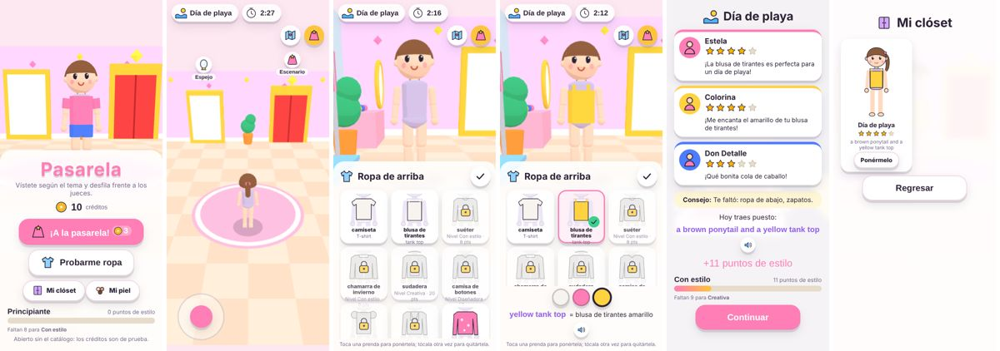

# Pasarela

Juego de Noli (#19) al estilo de los juegos de vestir: sale un **tema** ("Día de playa", "Pijamada"…), Noelia **camina con su personaje por un estudio en 3D** hasta los percheros, el tocador y la vitrina, **se viste** en 2 minutos y medio, **desfila** en la pasarela y tres **jueces** le dan estrellas con un comentario bonito y un consejo. Cada pasarela **cuesta créditos** que se ganan en los juegos educativos (#20), y los **puntos de estilo** que dan los jueces **abren ropa, colores y temas nuevos**.

Lo educativo: los temas y los comentarios se leen (frases cortas en español) y **cada prenda y cada color tienen su nombre en inglés** (se ve en el panel, se puede escuchar con la bocina, y al final aparece todo el atuendo en inglés: *"a pink T-shirt, blue shorts and white sneakers"*).



## Cómo se juega

| | Teléfono o tableta (dedo) | TV (control) o teléfono como control |
|---|---|---|
| Caminar | Joystick con el pulgar (abajo a la izquierda), o tocar el piso | Flechas (mantener apretada = seguir caminando) |
| Ir a un mueble | Tocar su letrero, o el botón del mapa "Ir a…" | OK lejos de un mueble abre "¿A dónde vamos?" y camina sola |
| Abrir la ropa | Tocar el aviso "Ver ropa de arriba" al acercarse | OK junto al mueble |
| Escoger | Tocar la prenda (otra vez = quitarla) y luego el color | Flechas entre prendas y colores, OK escoge |
| Cerrar el panel | La palomita | Atrás |
| Ir a la pasarela | Botón dorado arriba a la derecha, o caminar a la puerta roja | OK en la puerta |
| Salir | La casita del catálogo, o Atrás en el inicio | Atrás (en una pasarela, primero pregunta) |

En la TV el Magic Remote de LG también sirve como puntero: sus clics son como tocar.

**Sin créditos** se puede entrar al **probador libre**: caminar y probarse toda la ropa abierta, sin tema, sin tiempo y sin puntos. **Mi clóset** guarda los últimos 12 atuendos (con su tema, estrellas y la frase en inglés) y "Ponérmelo" los vuelve a poner. **Mi piel** cambia el tono de piel del personaje.

Si el aparato no tiene WebGL o va muy lento, el juego ofrece el **modo sencillo** (2D): la misma ropa, sin caminar (los muebles son botones) y una pasarela animada. Ver [RENDIMIENTO.md](RENDIMIENTO.md).

## Probarlo

- **Dentro del catálogo:** `python3 -m http.server 8000` en la raíz del repo y abrir `http://localhost:8000` (o `?modo=tv`). Los créditos son los del catálogo: se ganan con Sumas y restas o Spelling, o en *Créditos → Para papás*.
- **Solo:** `http://localhost:8000/minijuegos/pasarela/`. El kit simula 10 créditos (`localStorage["noli.solo.creditos"]`).
- **Parámetros útiles:** `?modo2d` (forzar el modo sencillo), `?fps` (cuadros por segundo, dibujos y triángulos), `?revisar` (si los datos tienen errores, enseñarlos en pantalla en lugar de solo en la consola), `?sinaviso` (no ofrecer el modo sencillo aunque vaya lento; para pruebas en Chromium sin GPU).
- **Probador de prendas:** `herramientas/probador.html` enseña cualquier prenda en el personaje, en cualquier color y postura, con su número de triángulos. Ver [ASSETS.md](ASSETS.md).
- **Pruebas:** `npm test` en la raíz (incluye `tests/pasarela.test.js`). Ver [PRUEBAS.md](PRUEBAS.md).

## Mapa de la carpeta

```
minijuegos/pasarela/
├── juego.json            manifiesto: "creditos": "gasta", "costo": 3
├── index.html            capas de la pantalla (ARQUITECTURA.md § Pantalla)
├── estilo.css            estilos propios (teléfono, TV, modo sencillo)
├── icono.svg             la tarjeta del catálogo
├── datos/                TODO lo que se puede cambiar sin tocar código
│   ├── config.json       costo, tiempo, categorías, etiquetas, tonos de piel, movimiento
│   ├── prendas.json      la ropa (54 prendas): nombres es/en, etiquetas, colores, piezas 3D
│   ├── temas.json        los 12 temas: qué etiquetas y colores piden
│   ├── colores.json      la paleta (15 colores con nombre en español e inglés)
│   ├── desbloqueos.json  los 8 niveles de estilo y qué abre cada uno
│   ├── zonas.json        el estudio: muebles, dónde se para el personaje
│   └── jueces.json       los tres jueces y qué le importa a cada uno
├── src/                  lógica pura (sin Three.js ni DOM): se prueba en Node
│   ├── datos.js          revisar e indexar los JSON
│   ├── atuendo.js        poner y quitar ropa, la frase en inglés
│   ├── puntuacion.js     los jueces: fórmulas y comentarios
│   ├── espanol.js        el/la/los/las, perfecto/perfecta…
│   ├── progreso.js       puntos de estilo, niveles, desbloqueos, clóset
│   ├── movimiento.js     caminar, chocar, zonas, rutas
│   ├── partida.js        la máquina de estados
│   ├── escena/           Three.js: escena, personaje, formas, materiales, estudio, pasarela, modelos .glb
│   └── ui/               la interfaz: juego.js (controlador), pantallas, vistas 3D/2D, joystick, voz, íconos, dibujo 2D
├── modelos/tiara.glb     una prenda hecha en Blender (el ejemplo del pipeline)
├── vendor/               Three.js r160.1 y su cargador de glTF (MIT)
├── herramientas/         probador.html, simular-curva.mjs, blender/tiara.py
├── tests/pasarela.test.js
└── docs/                 esta documentación
```

## Documentación

| Documento | Qué tiene |
|---|---|
| [ARQUITECTURA.md](ARQUITECTURA.md) | Capas, módulos, la máquina de estados, cómo entra cada acción del control, el ciclo de vida de la escena |
| [ESCENA-3D.md](ESCENA-3D.md) | Cámara, luces, materiales, el personaje y sus anclas, las formas de la ropa, el estudio, la pasarela, calidad por aparato |
| [ASSETS.md](ASSETS.md) | Cómo agregar ropa: con formas en `prendas.json` (paso a paso) o con Blender (`.glb`) |
| [DISENAR-ROPA.md](DISENAR-ROPA.md) | Guía corta para Noelia: de un dibujo a una prenda del juego |
| [JUEGO.md](JUEGO.md) | Reglas, temas, la fórmula de los jueces con ejemplos, créditos, puntos de estilo y la curva de desbloqueo, qué se guarda |
| [RENDIMIENTO.md](RENDIMIENTO.md) | Presupuesto, mediciones, cómo baja la calidad sola y el modo sencillo 2D |
| [DECISIONES.md](DECISIONES.md) | Por qué se hizo así (ADR) |
| [PRUEBAS.md](PRUEBAS.md) | Pruebas automáticas y la lista de pruebas a mano por aparato |
| [LICENCIAS.md](LICENCIAS.md) | De dónde sale cada cosa y con qué licencia |
