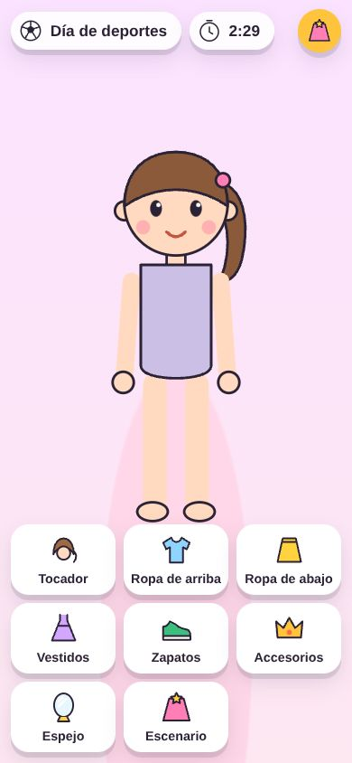

# Rendimiento

Meta del issue: **≥ 30 fps en el teléfono, la LG (webOS) y la Samsung (Tizen)**, y nunca una pantalla en blanco.

## Presupuesto

| Qué | Límite | Hoy | Cómo se revisa |
|---|---|---|---|
| Triángulos del personaje vestido | < 15 000 | 8 600 – 10 000 (el peor medido: rizos + sudadera + tutú + pantuflas + mochila) | Probador (`herramientas/probador.html`) |
| Triángulos de una prenda | < 6 000 | Prueba automática (falla si alguna pasa) | `npm test` |
| Estudio completo en pantalla | < 30 000 triángulos, < 150 dibujos por cuadro | **≈ 11 000 triángulos, 88–103 dibujos** | `?fps` |
| Pasarela en pantalla | < 50 000 triángulos, < 300 dibujos | **≈ 40 000 triángulos, 252 dibujos** (4 personajes vestidos y 23 focos) | `?fps` |
| Modelo `.glb` | < 2 000 triángulos, < 200 KB | tiara: 376 triángulos, 24 KB | Prueba automática |
| Texturas | ≤ 1024 px | Una sola de 64×64 (el piso) | — |
| Descarga | — | Three.js 670 KB (167 KB comprimido), cargador glTF 140 KB (≈ 30 KB comprimido), el juego 210 KB (63 KB comprimido) | — |

"Dibujos" = llamadas de dibujo por cuadro (`renderer.info.render.calls`); en las TVs suelen pesar más que los triángulos. Bajan solos porque solo se dibuja el lugar donde está la cámara (el estudio o la pasarela, no los dos: así el estudio pasó de 309 a 88 dibujos).

## Mediciones

Cómo medir en un aparato: abrir el juego **solo** con `?fps` (en la TV, en su navegador: `https://gcarrerap.github.io/noli/minijuegos/pasarela/?fps`; se juega con el control igual, con créditos de prueba). Abajo a la derecha sale `fps · calidad · dibujos · triángulos`. Anotar: en el inicio, caminando en el estudio 10 s y durante el desfile. `diagnostico.html` da el modelo de la tarjeta gráfica y si hay WebGL.

| Aparato | Navegador | Fecha | Inicio | Estudio | Desfile | Calidad a la que se quedó | Notas |
|---|---|---|---|---|---|---|---|
| Chromium sin tarjeta gráfica (SwiftShader, todo por CPU, en la nube) | Chromium 141 headless | 2026-10-08 | 5 fps | 8–9 fps | 10 fps | baja | **No sirve como medida de un aparato real**: dibuja sin GPU. Sirvió para confirmar que, si va lento, la calidad baja sola y se ofrece el modo sencillo, y para medir dibujos y triángulos (que no dependen del aparato). |
| Teléfono de Noelia | | *pendiente* | | | | | |
| LG webOS | | *pendiente* | | | | | |
| Samsung OLED 77" (Tizen) | | *pendiente* | | | | | |

**Pendiente honesto:** las tres mediciones reales no se pudieron hacer desde la sesión donde se programó el juego (no hay acceso a los aparatos). Se piden en la lista de pruebas a mano de [PRUEBAS.md](PRUEBAS.md) y hay que llenar esta tabla en el PR que las haga. Si alguna TV no llega a 30 fps en `media`, mirar primero los dibujos de la pasarela (abajo, "Si no alcanza").

## Calidad que se ajusta sola

`kit/3d/escena.js` (compartida con el mundo del menú principal, que usa las mismas reglas: ver `docs/MUNDO.md`):

1. Empieza en **alta** (`pixelRatio` hasta 2, antialias) en teléfono y tableta, y en **media** (`pixelRatio` 1, sin antialias) en la TV. El antialias se decide al crear el renderer y no se puede cambiar después; en la TV no se usa porque dibuja a 1080p o 4K con una GPU de tele.
2. Mide los fps cada segundo. **3 segundos seguidos por debajo de 26** → baja un nivel: alta → media → baja (`pixelRatio` 0.7).
3. Ya en **baja** y por debajo de 15 → pregunta "Este aparato va un poco lento. ¿Quieres cambiar al modo sencillo?" (una vez; si dice que no, sigue en 3D).
4. Si la pestaña se oculta, deja de dibujar.

Otras cosas que ayudan: sin sombras reales (una sombra redonda), materiales compartidos por color, geometrías compartidas por medida, esferas chicas con menos caras, `dt` máximo de 50 ms (si la TV se traba, el personaje no salta).

## Respaldo 2D (modo sencillo)

Para que **nunca** quede la pantalla en blanco:

| Cuándo | Qué pasa |
|---|---|
| El navegador no tiene WebGL (`hayWebGL()` = no) | Arranca directo en modo sencillo |
| Crear la escena 3D truena | Se atrapa el error y arranca en modo sencillo |
| Va muy lento (arriba) y dice que sí | Se libera la escena 3D (`dispose`) y cambia al modo sencillo; se recuerda **en ese aparato** (`localStorage["noli.pasarela.vista"] = "2d"`) |
| `?modo2d` | Forzado, para probar |

El modo sencillo (`src/ui/vista2d.js` + `src/ui/dibujo2d.js`) dibuja la muñeca en SVG con la misma ropa (cada prenda tiene su figura `dibujo2d`), los muebles son botones grandes en lugar de caminar, y la pasarela es una animación CSS. El tema, el reloj, el panel de ropa, los jueces, los créditos y los desbloqueos son los mismos.

Para volver al 3D en un aparato que se quedó en modo sencillo: borrar los datos del sitio o, en la consola, `localStorage.removeItem("noli.pasarela.vista")`.

## Si no alcanza

En orden de lo que más ayuda y menos se nota:

1. **Pasarela:** juntar las mallas de cada juez en una sola por material (`BufferGeometryUtils.mergeGeometries`) — los jueces casi no se mueven. Bajaría de ~250 a ~80 dibujos.
2. Bajar los focos de la pasarela (14 → 6) y que no parpadeen (comparten material).
3. Empezar la TV en `baja`.
4. Reducir segmentos de los tubos (18 → 12) en `formas.js`.
